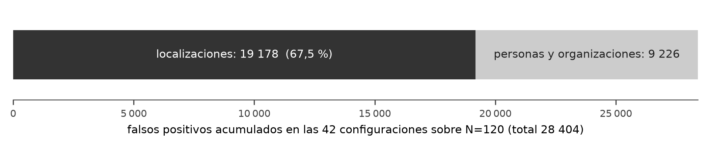
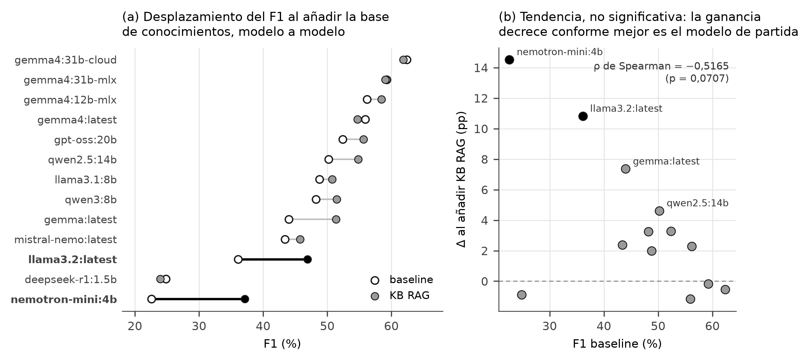

# Clasificación y Extracción de Entidades Nombradas (NER) en Noticias de Cumplimiento Normativo Corporativo Mediante Modelos de Lenguaje Grande Ejecutados Localmente con Soberanía de Datos

**Eduardo Mauricio Ahumada Gallardo**

Austranet — Departamento de Informática, Universidad Técnica Federico Santa María, Valparaíso, Chile

eahumada@gmail.com

## Resumen

Las instituciones financieras sujetas a regulaciones AML/KYC deben vigilar grandes volúmenes de noticias no estructuradas buscando entidades de riesgo. Hacerlo manualmente no escala y delegarlo en APIs en la nube expone información sensible a terceros. Este trabajo diseña, implementa y evalúa un sistema soberano de reconocimiento de entidades nombradas (NER) con modelos de lenguaje grande de código abierto en local mediante Ollama sobre Apple Silicon, con arquitectura pub/sub multihilo, concurrencia adaptativa (AIMD) y capa Factory/Facade. La validación comparó trece modelos sobre 120 artículos, 105 en español, del corpus periodístico, y 30 artículos en inglés del corpus del dominio AML/KYC; contrastó la extracción directa con la generación aumentada por recuperación (RAG) contextual y midió las diferencias con ANOVA y Tukey HSD. El beneficio del RAG decrece con la capacidad del modelo: solo alcanza significancia en el más débil de los trece (+12,3 puntos de F1) y es marginal en los mayores. Redactar el prompt en español con ejemplos *few-shot* aporta +10,4 puntos en el corpus de quince artículos, sin replicar sobre el corpus mayor. El mejor modelo local alcanza 81,47 % de F1 sobre el corpus periodístico y 90,16 % sobre el corpus del dominio AML/KYC, preservando la confidencialidad.

**Palabras clave:** Reconocimiento de Entidades Nombradas (NER), Modelos de Lenguaje Grande (LLM), Cumplimiento Normativo (AML/KYC), Soberanía de Datos, Generación Aumentada por Recuperación (RAG).

## Abstract

Financial institutions subject to AML/KYC regulations must monitor large volumes of unstructured news for risk entities. Doing so manually does not scale, and delegating it to cloud APIs exposes sensitive information to third parties. This work designs, implements and evaluates a sovereign Named Entity Recognition (NER) system using open-source Large Language Models locally through Ollama on Apple Silicon hardware, with a multithreaded pub/sub architecture, adaptive concurrency control (AIMD) and a Factory/Facade layer. Validation compared thirteen models on 120 articles, 105 in Spanish, from the news corpus, and 30 English articles from the AML/KYC domain corpus; contrasted direct extraction with contextual retrieval-augmented generation (RAG) and measured the differences with ANOVA and Tukey HSD. The benefit of RAG decreases with model capacity: it reaches significance only in the weakest of the thirteen (+12.3 F1 points) and is marginal in the larger ones. Writing the prompt in Spanish with *few-shot* examples yields +10.4 points on the fifteen-article corpus, without replicating on the larger corpus. The best local model reaches 81.47 % F1 on the news corpus and 90.16 % on the AML/KYC domain corpus, preserving confidentiality.

**Keywords:** Named Entity Recognition (NER), Large Language Models (LLM), Regulatory Compliance (AML/KYC), Data Sovereignty, Retrieval-Augmented Generation (RAG).

## Índice de contenidos

1. [Introducción](#1-introducción)
2. [Marco teórico y estado del arte](#2-marco-teórico-y-estado-del-arte)
3. [Descripción del sistema propuesto](#3-descripción-del-sistema-propuesto)
4. [Diseño experimental](#4-diseño-experimental)
5. [Resultados experimentales](#5-resultados-experimentales)
6. [Discusión de los resultados](#6-discusión-de-los-resultados)
7. [Conclusiones y trabajo futuro](#7-conclusiones-y-trabajo-futuro)
- [Referencias](#referencias)
- [Anexos](#anexos)

## 1. Introducción

### 1.1 Contexto y Motivación

Las instituciones financieras operan bajo un marco regulatorio estricto que les obliga a identificar y gestionar entidades de riesgo en tiempo real. Las regulaciones internacionales Anti-Money Laundering (AML) y Know Your Customer (KYC), implementadas en Chile por la Unidad de Análisis Financiero (UAF) [22] y la Comisión para el Mercado Financiero (CMF), exigen la detección de Personas Políticamente Expuestas (PEP), sujetos sancionados y vínculos con redes de lavado de activos en flujos continuos de información pública.

El proceso actual en instituciones como Austranet implica la revisión manual de cientos de artículos periodísticos diarios por analistas especializados, un proceso cuyo costo, estimado a partir del proceso vigente en Austranet, asciende a unos USD 8,75 por artículo analizado (el detalle del cálculo se expone en §5.5). A nivel global, según Verified Market Research el mercado de RegTech se valoró en USD 15,68 mil millones en 2020 y se proyecta que alcance USD 87,17 mil millones hacia 2028, con una CAGR del 23,92 % durante 2021-2028, evidenciando la urgencia de soluciones automatizadas y escalables [21].

Dos rasgos del problema explican por qué no basta con una solución puntual. El primero es que la referencia contra la que se coteja **cambia constantemente**: la lista de Nacionales Especialmente Designados del Departamento del Tesoro de los Estados Unidos [19], que es la fuente empleada en este trabajo, incorpora y retira designaciones cada pocos días, de modo que un sistema que memorice nombres queda desactualizado por construcción y la vigilancia tiene que ser un proceso continuo y no una carga inicial. El segundo es la asimetría del error: una mención pasada por alto puede materializarse en el ingreso de un sujeto sancionado a la cartera, con consecuencias regulatorias y reputacionales que la Ley N.º 19.913 [22] atribuye a la propia institución, mientras que un falso positivo solo cuesta el tiempo del analista que lo descarta. Esa asimetría orienta todo el diseño hacia la exhaustividad, y es la razón por la que las tasas de alucinación se miden aquí con tanto detalle como el acierto.

### 1.2 Planteamiento del Problema

El problema es de naturaleza técnico-operativa: extraer automáticamente entidades nombradas (personas y organizaciones) desde noticias no estructuradas en español, con precisión suficiente para sostener una decisión de cumplimiento, en un dominio donde la ambigüedad referencial es la norma y sin que el texto abandone la infraestructura de la institución.

Ninguna de las alternativas disponibles satisface simultáneamente esas condiciones. La **revisión manual** ofrece la máxima precisión, pero su coste crece linealmente con el volumen y no escala ante un flujo continuo de noticias. Los sistemas basados en reglas y expresiones regulares resultan frágiles ante la variación morfológica del español, donde un mismo nombre admite múltiples formas según la posición, la partícula y la acentuación. Las APIs comerciales en la nube aportan la capacidad necesaria, pero transfieren texto que puede contener información de clientes a un tercero, lo que en una entidad regulada obliga a suscribir acuerdos de tratamiento de datos y amplía la superficie de exposición; su coste, además, se vuelve prohibitivo al procesar por lotes. Los **modelos supervisados** del tipo BERT-NER [2] alcanzan el mejor desempeño publicado [7], [15], pero requieren miles de ejemplos etiquetados en el dominio objetivo, inexistentes en español para cumplimiento financiero.

La carencia de datos etiquetados no es una suposición de partida sino una constatación de este trabajo. Al construir el material de evaluación no se encontró ningún corpus de cumplimiento financiero anotado en español, y hubo que componerlo combinando quince artículos de un conjunto europeo sobre corrupción, que están en inglés, con ciento cinco artículos de un corpus periodístico general español. Esa composición no es un atajo: es la mejor aproximación disponible, y sus consecuencias sobre la interpretación de los resultados se discuten en §4.1 y en el capítulo 6.

A la carencia de datos se suma una dificultad de medición que el planteamiento no puede dar por resuelta. Evaluar extracción de entidades exige decidir cuándo dos cadenas designan la misma entidad, y esa decisión no es binaria: entre «Isabel dos Santos» y «Isabel dos Santos, hija del expresidente» hay una diferencia que un cotejo literal penalizaría y un analista no. El trabajo adopta por ello un emparejamiento aproximado cuyo umbral, sus límites y los sesgos que introduce se documentan en §3.3, porque de esa elección dependen todas las cifras que siguen.

La brecha que este trabajo aborda se sitúa precisamente en esa intersección vacía: obtener un desempeño aprovechable sin datos etiquetados del dominio, sin ceder los datos a un tercero y con una medición cuyos límites estén declarados.

### 1.3 Hipótesis de Trabajo

> **Hipótesis:** Es viable implementar un sistema soberano de extracción y clasificación de entidades financieras para cumplimiento corporativo (AML/KYC) utilizando modelos de lenguaje de código abierto de escala media-grande (8B–31B parámetros) ejecutados localmente, alcanzando un desempeño competitivo en español (F1-Score ≥ 70%) mediante técnicas sistemáticas de prompt engineering y few-shot learning, eliminando la fuga de datos confidenciales y reduciendo los costos operativos en más del 60%.

**Variables independientes:** (1) Modelo LLM seleccionado; (2) Estrategia de prompt (zero-shot/few-shot, inglés/español).  
**Variables dependientes:** (1) F1-Score por tipo de entidad; (2) Tasa de alucinaciones; (3) Latencia de procesamiento; (4) Consumo de VRAM.

### 1.4 Objetivos

**Objetivo General:** Diseñar, implementar y validar un sistema soberano de extracción de entidades nombradas para cumplimiento normativo (AML/KYC) basado en LLMs de código abierto ejecutados localmente.

**Objetivos Específicos:**
1. Diseñar e implementar una arquitectura pub/sub multithreading con control adaptativo de concurrencia para la ejecución segura de LLMs de gran escala en hardware Apple Silicon.
2. Evaluar y comparar el desempeño de modelos de lenguaje de código abierto generativos (familias Gemma, Llama, DeepSeek, Qwen, Mistral, GPT-OSS, Nemotron) en la tarea de NER sobre corpus de sanciones financieras en inglés y de noticias en español: **12 modelos** en el benchmark exploratorio N=15 (§5.1) y **13 modelos** en el estudio principal N=120 con KB RAG (§5.3.1).
3. Ejecutar una comparación sistemática de cuatro configuraciones de prompt (zero-shot/few-shot × inglés/español) (un diseño factorial 2×2, habitualmente llamado *ablation study* en la bibliografía en inglés) para cuantificar el impacto de la localización lingüística y el aprendizaje en contexto.
4. Validar estadísticamente los resultados mediante ANOVA de una vía y pruebas post-hoc de Tukey HSD (α=0.05) sobre un corpus estadísticamente significativo (N≥30).
5. Demostrar una reducción de costos operativos del 60–80% respecto a la revisión manual, manteniendo una tasa de alucinaciones inferior al 5%.

### 1.5 Enfoque de Solución y Metodología de Validación

La solución adoptada consiste en operar modelos de lenguaje generativos de código abierto **enteramente sobre infraestructura propia**, describiendo la tarea de extracción en el propio *prompt* en lugar de ajustar los pesos del modelo. Esta elección resuelve de raíz las dos restricciones del problema (no exige corpus etiquetado y no expone el texto), a cambio de asumir dos inconvenientes que el sistema debe gestionar: una salida no estructurada por construcción, que se fuerza a un esquema verificable, y un riesgo de alucinación que debe medirse explícitamente. El capítulo 2 revisa las alternativas disponibles y el capítulo 3 justifica cada decisión frente a ellas.

La validación sigue una estrategia empírica en tres etapas. Primero se establece una **línea base comparativa** ejecutando el conjunto de modelos candidatos sobre un corpus anotado, con el fin de acotar el espacio de opciones viables. Después se aísla el efecto de las variables de *prompt* mediante un diseño factorial que cruza idioma y presencia de ejemplos, evaluando las cuatro combinaciones sobre el mismo modelo y corpus. Finalmente se contrasta la extracción directa frente a la aumentada por recuperación sobre un corpus ampliado, y se determina mediante ANOVA de una vía y pruebas post-hoc de Tukey HSD si las diferencias observadas son estadísticamente significativas o atribuibles a la variabilidad entre artículos. Todas las corridas quedan definidas por un fichero de configuración reproducible, así que cualquier resultado del informe pueda rehacerse a partir de los artefactos publicados.

### 1.6 Estructura del Documento

El capítulo 2 revisa las familias de técnicas aplicables al problema (desde los sistemas basados en reglas hasta los modelos generativos), las estrategias de aumento por recuperación y las alternativas de ejecución local, y cierra fijando los criterios de selección. El capítulo 3 describe el sistema propuesto y justifica cada decisión de diseño frente a esos criterios. El capítulo 4 detalla el diseño experimental: corpus, modelos, configuraciones de *prompt*, métricas e infraestructura. El capítulo 5 presenta los resultados de los tres experimentos y el capítulo 6 los discute, con especial atención a la contribución metodológica sobre qué información conviene recuperar. El capítulo 7 recoge las conclusiones y las líneas de trabajo futuro. Los anexos reúnen el material de reproducción: estructura del repositorio, *prompts* completos, configuración del entorno y el análisis detallado del defecto de codificación del corpus.

## 2. Marco teórico y estado del arte

Este capítulo revisa las familias de técnicas disponibles para resolver el problema planteado y establece los criterios con los que, en el capítulo 3, se selecciona una de ellas. El recorrido no pretende ser exhaustivo sino comparativo: interesa entender qué exige cada alternativa, qué garantiza y en qué condiciones deja de ser aplicable al caso de estudio, caracterizado por la ausencia de corpus etiquetados en español para el dominio de cumplimiento y por la obligación de no exponer los datos a terceros.

### 2.1 El problema y las familias de técnicas disponibles

El Reconocimiento de Entidades Nombradas (NER) es una subtarea del Procesamiento de Lenguaje Natural que consiste en localizar fragmentos de texto y clasificarlos en categorías semánticas predefinidas. En cumplimiento normativo las categorías relevantes son **Personas** (PER), **Organizaciones** (ORG) y **Ubicaciones** (LOC), pues son las que permiten cotejar una noticia contra listas de sanciones [19] y de personas expuestas políticamente [38].

Formalmente se plantea como un problema de etiquetado de secuencias: dado un texto segmentado en tokens, se asigna a cada uno una etiqueta según el esquema IOB2, que distingue el inicio de una entidad (*Beginning*), su continuación (*Inside*) y el texto ajeno a toda entidad (*Outside*). Esta formulación, heredada de la tarea compartida CoNLL-2002 [12], es la que fija el criterio de evaluación: una entidad se considera correctamente extraída solo si coinciden a la vez sus límites y su categoría.

El criterio de coincidencia entre lo extraído y la referencia también admite alternativas. La más estricta exige coincidencia **exacta** de la cadena, lo que penaliza como error cualquier diferencia de acentuación o de un carácter. Una alternativa **basada en tokens** (como la superposición de conjuntos de palabras, usada en tareas de resumen automático) tolera el orden pero no distingue variantes de un mismo token. Este trabajo adopta en su lugar el emparejamiento **difuso a nivel de caracteres**, mediante la **distancia de Indel** —el número mínimo de inserciones y supresiones para transformar una cadena en otra, variante de la distancia de Levenshtein que excluye las sustituciones—, normalizada a una escala de similitud; tolera variaciones menores de forma (tildes, mayúsculas, un carácter de más) sin premiar coincidencias espurias, a costa de ser sensible al orden de las palabras. El compromiso concreto se detalla en §3.3.

La dificultad del dominio no proviene de la definición de la tarea sino de tres rasgos del material periodístico financiero. Primero, la **ambigüedad referencial**: un mismo token puede designar una persona o una organización según el contexto («Santander» es tanto un apellido como un banco y una ciudad). Segundo, la **variación morfológica del español**, con nombres compuestos, partículas («de», «del», «y») y tildes que fragmentan la coincidencia exacta. Tercero, la **escasez de datos etiquetados**: no existe un corpus público en español anotado para el dominio AML/KYC, lo que descarta de entrada cualquier técnica que dependa de un volumen sustancial de ejemplos supervisados.

Las aproximaciones al problema pueden ordenarse por el tipo de conocimiento que requieren y por el coste de adaptarlas a un dominio nuevo.

Los sistemas basados en reglas y diccionarios (*gazetteers*) identifican entidades por coincidencia contra catálogos y por patrones léxicos escritos a mano. Son transparentes, deterministas y no requieren entrenamiento, pero su cobertura se limita a lo enumerado: fracasan ante nombres nuevos, que es precisamente el caso de interés en la detección temprana de riesgo.

Los **Campos Aleatorios Condicionales (CRF)** [10], [17] modelan la secuencia de etiquetas como un campo probabilístico condicionado al texto, capturando dependencias entre etiquetas contiguas. Superan a las reglas en generalización, pero dependen de ingeniería manual de rasgos y de un corpus anotado del orden de miles de oraciones.

Las **arquitecturas neuronales BiLSTM-CRF** [24] sustituyen los rasgos manuales por representaciones aprendidas, eliminando gran parte del trabajo de ingeniería a cambio de un requisito de datos aún mayor.

Los **codificadores Transformer pre-entrenados** (BERT [2] y sus variantes multilingües como XLM-R [23]) constituyen el estado del arte académico. Partiendo de un modelo pre-entrenado, un ajuste fino alcanza 88,43 % de F1 en español sobre CoNLL-2002 con un codificador monolingüe [7], y 82,1 % de micro-F1 sobre FiNER-139, un corpus financiero en inglés cuya tarea es etiquetar magnitudes según la taxonomía XBRL y no identificar personas y organizaciones [15]. Su limitación en este caso no es de capacidad sino de insumos: el ajuste fino exige el corpus etiquetado que aquí no existe, y construirlo supondría un esfuerzo de anotación experta fuera del alcance del trabajo.

Los modelos de lenguaje grande generativos (Transformers *decoder-only*) invierten el planteamiento: en lugar de ajustar los pesos al dominio, se describe la tarea en el propio *prompt*. Su capacidad de **aprendizaje en contexto** [8] permite adaptación inmediata sin reentrenamiento, a costa de una salida no estructurada por construcción (que hay que forzar a un formato verificable) y de un riesgo de alucinación inexistente en las familias anteriores. La Tabla 1 las compara frente a los criterios de selección.

_Tabla 1. Familias de técnicas para el reconocimiento de entidades y su comportamiento frente a los criterios de selección_

| Familia | Datos etiquetados requeridos | Adaptación a dominio nuevo | Riesgo principal |
|:---|:---|:---|:---|
| Reglas y diccionarios | Ninguno | Inmediata pero de cobertura cerrada | No detecta entidades no catalogadas |
| CRF | Miles de oraciones | Reentrenamiento e ingeniería de rasgos | Coste de anotación |
| BiLSTM-CRF | Decenas de miles | Reentrenamiento | Coste de anotación |
| Transformer con ajuste fino | Miles, del dominio | Ajuste fino | Coste de anotación; el mejor F1 publicado |
| LLM generativo en contexto | Ninguno | Inmediata mediante *prompt* | Alucinación y salida no estructurada |

La última fila es la única compatible con la restricción de datos del proyecto, y por eso concentra el resto de la revisión.

### 2.2 Aprendizaje en contexto y diseño de prompts

La arquitectura Transformer [4], sostenida sobre el mecanismo de atención multi-cabeza, es la base común de todos los modelos evaluados. Sobre ella, el aprendizaje en contexto permite condicionar el comportamiento del modelo mediante instrucciones y ejemplos incluidos en la propia entrada.

Se distinguen dos regímenes. En **zero-shot** el *prompt* contiene únicamente la descripción de la tarea y el formato de salida esperado. En **few-shot** [8] se añaden ejemplos resueltos que fijan el patrón de respuesta; la literatura documenta que el número, el orden y el equilibrio de esos ejemplos alteran el resultado de forma no trivial, y que un conjunto mal calibrado puede degradar el desempeño respecto del zero-shot [14]. Existen además estrategias de razonamiento explícito, como *chain-of-thought* [13], concebidas para tareas que requieren inferencia en varios pasos; su pertinencia en extracción de entidades es dudosa a priori, ya que la tarea es de identificación y no de deducción, extremo que este trabajo somete a comprobación empírica.

Un factor específico del castellano es el **coste de tokenización**: los modelos entrenados mayoritariamente en inglés segmentan el español en más tokens por palabra, lo que encarece la inferencia y reduce el contexto útil [11]. Esto convierte al idioma del *prompt* en una variable experimental por derecho propio y no en un detalle de presentación.

### 2.3 Aumento por recuperación y ejecución local

La Generación Aumentada por Recuperación (RAG) [1] fundamenta la generación en información recuperada en tiempo de consulta, en lugar de confiarla exclusivamente a los pesos del modelo; la práctica de diseño de estos sistemas está recogida con detalle en la literatura técnica [5]. La literatura reciente [6] distingue variantes por la naturaleza de lo recuperado, y esa distinción resulta determinante en NER.

Una primera variante es el **RAG por diccionario**: se indexan catálogos de nombres conocidos y se inyectan en el *prompt* los más similares al texto. Aporta cobertura sobre entidades ya catalogadas, pero introduce un sesgo de reconocimiento (el modelo tiende a proponer lo que se le ha sugerido), extremo que este trabajo comprueba empíricamente en §5.6, y no ayuda ante nombres ausentes del catálogo.

Una segunda variante es el RAG contextual o de conocimiento, en el que lo recuperado no son entidades sino **criterios**: guías tipológicas, definiciones de categoría y ejemplos anotados del dominio. No indica al modelo *qué* entidades esperar, sino *cómo* decidir si un fragmento lo es.

Una tercera configuración, adoptada por trabajos aplicados al ámbito financiero [9], emplea el propio documento como **contexto único**, restringiendo la extracción al texto presente y mitigando la alucinación extrínseca.

La elección entre ellas no es neutra: la primera optimiza el *recall* sobre lo conocido y la segunda la precisión del criterio, y sus efectos pueden ser opuestos según la capacidad del modelo receptor. El capítulo 5 contrasta empíricamente ambas.

La recuperación en ambas variantes depende de un mecanismo común: los **embeddings**, representaciones vectoriales de longitud fija que un modelo aprende de modo que textos semánticamente próximos queden cerca en ese espacio, incluso sin compartir palabras exactas. Buscar lo más relevante para un artículo se reduce entonces a una búsqueda por vecino más próximo, mucho más barata que comparar el texto completo contra cada candidato. Las **bases de datos vectoriales** (ChromaDB [32] en este trabajo) indexan esos vectores para hacer esa búsqueda eficiente incluso con miles de documentos candidatos, y son el componente que hace viable el RAG a la escala de este estudio.

Decidida la estrategia de recuperación, queda el problema de dónde ejecutar el modelo. Hacerlo sobre hardware de consumo exige **cuantización**: reducir la precisión numérica de los pesos para bajar el consumo de memoria, típicamente a 4 bits en formatos como GGUF con esquema Q4_K_M [30], con una pérdida de calidad reducida frente al ahorro obtenido [20]. Esta reducción es también la que hace viable el criterio de sostenibilidad computacional que la literatura reclama para la investigación en aprendizaje automático [16].

Entre los entornos de ejecución disponibles, **llama.cpp** [30] ofrece el motor de inferencia cuantizada de referencia pero exige gestión manual de modelos; **vLLM** [28] maximiza el rendimiento por lotes en servidores con GPU dedicada, escenario ajeno a este trabajo; **LM Studio** prioriza la interacción gráfica sobre la automatización; el entorno **MLX** de Apple [31] aprovecha específicamente la memoria unificada de Apple Silicon; y **Ollama** [29] encapsula llama.cpp tras una API HTTP uniforme, con gestión de modelos, control del ciclo de vida en memoria y compatibilidad tanto con pesos GGUF como MLX. Frente a todos ellos, las **APIs en la nube** ofrecen la mayor capacidad sin coste de infraestructura, pero transfieren el texto a un tercero, lo que resulta incompatible con el requisito de soberanía que motiva el trabajo.

### 2.4 Arquitectura de ejecución concurrente y aislamiento de proveedores

La ejecución masiva de modelos locales plantea un problema de ingeniería distinto del NER en sí: cómo paralelizar la inferencia sin saturar el servicio ni desperdiciar capacidad, y cómo hacerlo sin atar el sistema a un proveedor concreto. Tres decisiones de diseño lo resuelven, cada una comparada aquí contra su alternativa más directa.

La primera es de desacoplamiento entre productor y consumidor. Un pipeline síncrono —procesar un artículo, esperar su respuesta, tomar el siguiente— ata el rendimiento a la latencia del modelo más lento y no permite variar el paralelismo sin reescribir el flujo de control. La arquitectura **publicador/suscriptor** (pub/sub) resuelve esto separando la ingesta de artículos, que los deposita en una cola, de su consumo, a cargo de un número variable de trabajadores suscritos a ella; ni el productor necesita saber cuántos consumidores hay, ni éstos necesitan conocerse entre sí, lo que permite ajustar su número en tiempo de ejecución sin tocar el productor.

La segunda es cuántos consumidores mantener activos. Un número **fijo**, decidido de antemano, es simple pero arriesga dos fallos simétricos: por debajo del óptimo desperdicia capacidad, y por encima satura el servicio con reintentos y respuestas truncadas. Un ajuste **multiplicativo en ambos sentidos** (duplicar al crecer, reducir a la mitad al fallar) reacciona rápido pero tiende a oscilar sin asentarse. Este trabajo adopta en su lugar **AIMD** (*Additive Increase, Multiplicative Decrease*), la política que sostiene el control de congestión en TCP [26]: crecer de a uno mientras el sistema permanece estable y recortar a la mitad ante la primera señal de saturación. Chiu y Jain demuestran que, de las cuatro combinaciones posibles entre incremento y decremento aditivo o multiplicativo, solo esta converge de forma estable y equitativa hacia el punto de operación máximo sostenible sin necesitar conocerlo de antemano [26]: el crecimiento lento explora el margen disponible mientras el recorte agresivo responde con margen de sobra ante el primer signo de exceso.

La tercera es cómo aislar el sistema de las diferencias entre proveedores de inferencia (Ollama local, OpenAI, Anthropic), que exponen APIs, formatos de error y modelos de autenticación distintos entre sí. Ramificar el código llamador según el proveedor acopla toda decisión futura de añadir o sustituir uno a cada punto de llamada. Los patrones de diseño **Factory** y **Facade** evitan ese acoplamiento: el primero centraliza la construcción del proveedor correcto a partir de su nombre, y el segundo expone una interfaz uniforme que oculta tras ella las diferencias de implementación. El efecto conjunto es que sustituir un proveedor, o añadir uno nuevo, no exige tocar ningún código que ya consuma la interfaz — la condición que hace posible el criterio C2 de soberanía intercambiable.

### 2.5 Validación estadística de comparaciones múltiples

Comparar el desempeño de varios modelos exige distinguir las diferencias reales de las que produce el azar, porque cada artículo del corpus tiene su propia dificultad y un modelo puede aventajar a otro por haberle tocado un reparto favorable. El instrumento habitual es el análisis de varianza (ANOVA) de una vía, que contrasta la hipótesis nula de que todos los grupos comparados proceden de la misma población. Su estadístico F compara la variabilidad *entre* grupos con la variabilidad *dentro* de cada uno: cuanto mayor es F, más difícil resulta atribuir las diferencias observadas a la variación interna. Un valor p pequeño permite rechazar esa hipótesis nula, pero el ANOVA solo indica que **alguna** diferencia existe, no cuál.

Responder a esa segunda pregunta corresponde a las **pruebas post-hoc**, y aquí aparece un problema de fondo. Comparar todos los pares de un conjunto de veintiséis grupos supone 325 contrastes, y al 5 % de significancia cabría esperar unos dieciséis positivos por puro azar. La prueba de **Tukey HSD** (*Honestly Significant Difference*) [25] corrige ese efecto controlando la tasa de error **por familia**: garantiza que la probabilidad de cometer algún falso positivo en el conjunto completo de comparaciones siga siendo del 5 %, no del 5 % en cada una. Lo consigue sustituyendo la distribución t por la del **rango estudentizado**, más ancha y por tanto más exigente. Es una prueba deliberadamente conservadora, y esa es su virtud: una diferencia que la supera resulta difícil de discutir.

Dos instrumentos complementan la lectura. Los intervalos de confianza al 95 % expresan el margen dentro del cual cabe esperar el valor real de cada media, de modo que dos intervalos muy solapados advierten de una diferencia poco sólida aunque las medias difieran. Y el **análisis de sensibilidad** recalcula las métricas excluyendo las observaciones atípicas (en este trabajo, los artículos de longitud inusual), para comprobar que ninguna conclusión depende de unos pocos casos extremos.

El ANOVA supone además que las observaciones son independientes entre sí y que la varianza es homogénea entre grupos (**homocedasticidad**). Cuando el mismo conjunto de artículos se evalúa bajo distintas condiciones, como ocurre en este trabajo, esa independencia no se cumple: las observaciones están apareadas, y el diseño estrictamente correcto es de **medidas repetidas**. La prueba no paramétrica de **Friedman** es su análogo cuando no puede asumirse normalidad, y sirve como control de robustez frente al ANOVA cuando el apareamiento se ignora. La homocedasticidad, por su parte, se contrasta con la prueba de **Levene**, en su variante centrada en la mediana (Brown-Forsythe), más robusta que la centrada en la media ante distribuciones asimétricas; su incumplimiento no invalida el ANOVA por sí solo en diseños balanceados, pero refuerza la conveniencia de una prueba de medidas repetidas.

Además de si dos medias difieren, interesa a veces si dos variables covarían: si el beneficio de una técnica crece o decrece, por ejemplo, con la capacidad del modelo. El coeficiente de **Pearson** [40] mide la asociación lineal y es sensible a valores atípicos; el de **Spearman** [41], calculado sobre los rangos y no sobre los valores, es más robusto a esas anomalías pero solo capta relaciones monótonas, no necesariamente lineales. Reportar ambos permite distinguir si una asociación aparente depende de la forma de la relación o de unos pocos casos extremos que un solo coeficiente no dejaría ver.

Conviene retener una asimetría de interpretación: que una diferencia **no** alcance significancia no demuestra que no exista, solo que los datos disponibles no bastan para descartar el azar.

### 2.6 Estado del arte y criterios de selección

La Tabla 2 posiciona este trabajo respecto de investigaciones recientes en NER para dominios financieros y regulatorios.

_Tabla 2. Estado del arte en reconocimiento de entidades para dominios financieros y regulatorios_

| Trabajo | Dataset | Modelo | Desempeño publicado | Privacidad | Idioma |
|:---|:---|:---|:---:|:---:|:---|
| BloombergGPT [3] | Corpus financiero propio | BLOOM 50B + dominio | 53,6-75,5 % F1 | Cloud | Inglés |
| FiNER-139 [15] | SEC 10-K/10-Q (etiquetado XBRL) | SEC-BERT-SHAPE | 82,1 % micro-F1 | Local | Inglés |
| Cañete et al. [7] | CoNLL-2002 (ES) | BETO (BERT español) | 88,43 % F1 | Local | Español |
| FinanceBench [9] | 361 informes SEC | GPT-4-Turbo + RAG | 50 % exactitud | Cloud | Inglés |
| **Este trabajo** | **CoNLL-2002 y Kleptotrace (N=120)** | **gemma4:31b-mlx local** | **81,47 % F1** | **100 % Local** | **Español (105/120)** |

Las cifras de la columna de desempeño publicado no son directamente comparables entre sí, porque cada trabajo mide una tarea distinta: FiNER-139 etiqueta magnitudes numéricas según la taxonomía XBRL y FinanceBench evalúa exactitud de respuesta sobre preguntas abiertas, no identificación de personas y organizaciones. Aun así, de la comparación se desprende una brecha: los trabajos que alcanzan el mejor F1 lo hacen sobre corpus en inglés y con infraestructura en la nube, mientras que los que preservan la privacidad no abordan el dominio de cumplimiento en español. Este trabajo se sitúa en esa intersección.

La revisión anterior deja fijados los criterios con los que el capítulo 3 justifica cada decisión de diseño: (C1) prescindir de datos etiquetados, por no existir corpus del dominio en español; (C2) preservar la soberanía del dato, lo que excluye toda API externa; (C3) operar sobre hardware de consumo, lo que obliga a cuantización y a gestión explícita de memoria; **(C4) producir salida verificable**, dado que el modelo elegido genera texto libre; y (C5) permitir comparación empírica entre variantes, tanto de *prompt* como de estrategia de recuperación.

## 3. Descripción del sistema propuesto

### 3.1 Justificación de las decisiones de diseño

Los cinco criterios con que cerró el capítulo anterior determinan, cada uno, una decisión concreta. Conviene explicitar el razonamiento antes de describir la implementación.

El primero (prescindir de datos etiquetados) descarta las cuatro primeras familias de la tabla comparativa del §2.1. Los CRF, las arquitecturas BiLSTM-CRF y el ajuste fino de codificadores Transformer ofrecen mejor F1 publicado, pero todos exigen un corpus anotado del dominio que en español no existe para cumplimiento financiero. Se adopta por tanto un modelo generativo operado mediante aprendizaje en contexto, la única familia que permite adaptación inmediata sin reentrenamiento; su contrapartida (salida no estructurada y riesgo de alucinación) se asume y se aborda más abajo.

El segundo criterio, la soberanía del dato, excluye las APIs comerciales: aventajan a los modelos abiertos en capacidad, pero transfieren el texto a un tercero. Se opta por ejecución íntegramente local y, entre los entornos revisados en §2.3, por Ollama. Pesaron tres razones: expone una API uniforme que permite intercambiar modelos sin tocar el código de orquestación, gestiona el ciclo de vida de los pesos en memoria (requisito imprescindible para encadenar modelos que no caben a la vez) y admite pesos GGUF y MLX, lo que habilita comparar ambas rutas de cuantización sobre el mismo arnés. Los modelos en la nube se conservan solo como línea base de comparación, no como parte de la solución.

El tercer criterio, operar sobre hardware de consumo, obliga a cuantizar los pesos (a cuatro bits en la mayoría de los casos) y a gestionar la memoria de forma explícita, según se detalla en §3.2. El cuarto, producir salida verificable, se traduce en exigir al modelo un objeto JSON de esquema fijo, validado al recibirlo y con una ruta de recuperación cuando el análisis sintáctico falla: es la contramedida directa al principal inconveniente de la familia elegida. El quinto, permitir la comparación empírica, exige que las variantes de *prompt* y de estrategia de recuperación se seleccionen por configuración y no modificando el código, así que cada corrida quede definida por un conjunto de parámetros reproducible.

### 3.2 Arquitectura, proveedores y orquestación

El sistema se organiza en cinco capas funcionales con responsabilidades separadas, así que cada una pueda evolucionar sin arrastrar a las demás. La Tabla 3 las detalla con sus módulos y su cometido.

_Tabla 3. Arquitectura del sistema por capas, con sus módulos y su detalle técnico_

| Capa | Módulo(s) | Detalle técnico |
|:---|:---|:---|
| 1. Capa de datos | `data_loader.py` + validador | Kleptotrace/CoNLL-2002 JSON → validación contra el esquema FollowTheMoney [38] → registros |
| 2. Orquestación | `main.py` + `pub_sub.py` | Cola pub/sub → controlador AIMD → gestor de lotes |
| 3. Proveedores LLM | Factory / Facade | `OllamaProvider`, `OpenAIProvider`, `AnthropicProvider` |
| 4. Evaluación | `evaluator.py` + `statistics.py` | F1 / Precisión / Recall / ANOVA / Tukey HSD |
| 5. Visualización | `dashboard.py` (Streamlit) | Siete pestañas: métricas, alucinaciones, ANOVA, eficiencia |

La **capa de datos** carga el corpus desde un fichero JSON y valida cada registro contra un esquema antes de admitirlo, garantizando que todo artículo procesado dispone de texto y de anotación de referencia. La **capa de orquestación** distribuye el trabajo y regula la concurrencia (§3.2). La **capa de proveedores** aísla la heterogeneidad de las APIs. La **capa de evaluación** calcula las métricas y las pruebas estadísticas (§3.3). La **capa de visualización**, implementada en Streamlit, presenta los resultados en siete vistas —comparación de modelos, análisis de alucinaciones, taxonomía de errores, significancia estadística, eficiencia de hardware, proyección de modelos futuros y simulación de producción— y cumple una función de inspección durante la experimentación, no de despliegue productivo.

La capa de proveedores es la que materializa el criterio C2 sin encerrar el trabajo en un único motor, aplicando los patrones *Factory* y *Facade* introducidos en §2.4 tras una interfaz común (`LLMProvider`, Anexo A.1). La selección del proveedor se resuelve por el prefijo del identificador del modelo, así que añadir un motor nuevo no requiere modificar el orquestador. Esta indirección tuvo una consecuencia práctica relevante durante la experimentación: un modelo abierto cuyo nombre comenzaba por `gpt-` era enrutado erróneamente hacia la API comercial, fallo que se detectó y corrigió discriminando por la presencia de etiqueta de versión propia de los identificadores locales. El episodio ilustra que la abstracción por convención de nombres exige verificación explícita del enrutamiento efectivo.

El núcleo de ejecución es un canal de publicación y suscripción con múltiples hilos. El productor publica lotes de artículos por modelo en una cola en memoria (con interfaz compatible con Redis para un eventual despliegue distribuido) y los consumidores los procesan en paralelo.

El número de consumidores no es fijo: lo regula el controlador **AIMD** introducido en §2.4 [26]. Mientras el sistema permanece estable (sin errores de limitación de tasa ni excepciones) durante una ventana de 600 segundos, el controlador añade un consumidor cada 120 segundos hasta un techo del 75 % del máximo configurado; ante el primer error de saturación reduce los consumidores a la mitad. Un cortacircuitos complementa la política: cinco fallos consecutivos abren el circuito, que fija la concurrencia en un único consumidor y sondea la recuperación tras un enfriamiento de 300 segundos; un primer lote exitoso lo vuelve a cerrar. El valor que el controlador recalcula se aplica al arrancar cada modelo o condición, mientras que el paralelismo interno de cada lote lo adopta de inmediato. Sobre el equipo de 48 GB (catorce núcleos, techo del controlador en nueve) el sistema escaló de forma estable hasta nueve consumidores concurrentes para el conjunto de modelos locales evaluados, de 1,5B a 31B; con lotes de tres registros, esos nueve consumidores equivalen a veintisiete extracciones simultáneas.

La gestión de memoria merece atención propia porque condicionó el alcance del estudio. Al terminar cada modelo se libera explícitamente su ocupación de GPU invocando la API de generación con `keep_alive=0`. Ahora bien, ese parámetro evita retener varios modelos a la vez, pero no reduce el footprint de uno solo, y esa distinción resultó decisiva. macOS expone en `recommendedMaxWorkingSetSize` [36] el techo de memoria que la GPU puede ocupar sin degradar el rendimiento; medido sobre los equipos de prueba equivale al 75 % de la memoria unificada, unos 12 GB en una máquina de 16 GB. Los modelos GGUF de 7B a 12B ocupan entre 7 y 9 GB (y los compactos de 1,5B a 3B, entre 1,7 y 4 GB), así que caben con holgura; la compilación MLX de 12B, en cambio, alcanza 15–16 GB y desborda ese techo. La compilación MLX de 31B llega a un footprint operativo de ~24,6 GB medidos sobre N=15 y hasta ~27 GB sobre N=120, mientras que la compilación GGUF se estabiliza en ~18,8 GB de pesos; ninguna de las dos puede cargarse en 16 GB ni siquiera de forma serial. La cuantización, además, no es homogénea: Q4_K_M en la mayoría de los pesos GGUF, Q4_0 en `mistral-nemo:latest`, MXFP4 en `gpt-oss:20b` y precisión mixta de cuatro bits en las compilaciones MLX, mientras que `gemma4:31b-cloud` corre en BF16 y por eso no compite en igualdad de condiciones de memoria. La ejecución se organizó en consecuencia en dos escalones de hardware, repartidos por footprint medido y no por número de parámetros: 16 GB para los modelos que se mantuvieron por debajo de ~12 GB (los GGUF de 1,5B a 12B) y un equipo de 48 GB, con techo asignable de ~36 GB, para el resto, esto es, los de 31B, las compilaciones MLX y `gpt-oss:20b`.

### 3.3 Módulo de evaluación

La comparación entre lo extraído y la anotación de referencia no puede ser literal, porque una diferencia de puntuación o un artículo antepuesto invalidarían una extracción correcta. El evaluador emplea por ello el emparejamiento difuso introducido en §2.1, implementado con la función `ratio` de la biblioteca *rapidfuzz* [33], que normaliza la distancia de Indel a una escala de 0 a 100 mediante la expresión `100 × (1 − d / (|a| + |b|))`. Ambas cadenas se pasan a minúsculas antes de compararlas, así que la coincidencia es insensible a mayúsculas. Se acepta como acierto toda similitud igual o superior a un umbral configurable, fijado en **85**.

La elección del umbral es un compromiso: por debajo se admiten emparejamientos entre nombres distintos que comparten apellido; por encima se rechazan variantes legítimas. Conviene explicitar dos límites de esta métrica, porque condicionan la lectura de los resultados. Al operar sobre caracteres y no sobre palabras, **es sensible al orden**: «Juan Pérez» y «Pérez Juan» obtienen 50 sobre 100 y no casan, mientras que una métrica basada en tokens les daría 100. Y al normalizar por la longitud conjunta, **penaliza las omisiones proporcionalmente**: «Banco Santander» frente a «Santander» obtiene 75 y queda por debajo del umbral, de modo que una extracción parcialmente correcta cuenta como error. Ambos efectos empujan las cifras a la baja. En sentido contrario opera el conteo de aciertos, que se realiza por entidad extraída: varias menciones que casan con una misma entidad de referencia suman cada una un acierto, lo que puede elevar la exhaustividad en un pequeño número de registros (entre el 2 % y el 6 % de ellos según la corrida). El efecto neto observado es conservador.

Sobre esa base se calculan precisión, exhaustividad y F1 por artículo, que después se promedian, y una **tasa de alucinación** que mide algo distinto de las anteriores: no compara con la anotación de referencia sino con el **texto de origen**. Una entidad se considera alucinada cuando no aparece literalmente en el artículo y, además, su mejor similitud contra las ventanas deslizantes del texto (del mismo número de palabras que la entidad) queda por debajo de **70**, umbral deliberadamente más laxo que el 85 del emparejamiento. La distinción importa: una entidad correctamente extraída del artículo pero ausente de la anotación de referencia cuenta como falso positivo, no como alucinación, porque el modelo no la inventó. El módulo incorpora además la validación estadística: ANOVA de una vía para contrastar si las diferencias entre modelos y modos son significativas, pruebas post-hoc de Tukey HSD para identificar qué pares concretos difieren, intervalos de confianza al 95 % por grupo y un análisis de sensibilidad que recalcula las métricas excluyendo los artículos atípicamente largos, con el fin de comprobar que ningún resultado depende de unos pocos casos extremos.

Un tercer límite, de naturaleza distinta a los anteriores porque no procede del cotejo sino del diseño, ya está corregido y no afecta a ningún resultado vigente de este informe: se documenta aquí por integridad de la medición. Los prompts piden tres categorías de entidad —personas, organizaciones y **localizaciones**, esta última lugares geográficos, la tercera categoría de §2.1—, pero los registros con los que se tomó esta medida anotaban solo las dos primeras, por un defecto de la cadena de preparación de datos y no de la anotación de origen: CoNLL-2002 sí anota localizaciones. El evaluador, al puntuar las tres categorías, contabilizaba como falso positivo toda localización correctamente extraída, sin ninguna forma de acertar en ella —efecto exclusivamente de precisión, sin omisiones posibles—, lo que explica que el **66,0 %** de los falsos positivos de aquel consolidado, 12 852 de 19 464, procedieran de esa categoría (la Figura 1 lo ilustra). El corpus vigente ya anota las localizaciones y la re-corrida que hoy sostiene la Tabla 7 (§5.3.1) mide ya las tres categorías; el detalle histórico y la medición restringida equivalente se conservan en el Anexo I.



_Figura 1. Composición de los falsos positivos sobre el consolidado publicado (N=120, veintiséis grupos), previo a la corrección del corpus. Dos de cada tres procedían de una categoría que ese corpus no anotaba y en la que, por tanto, ningún modelo podía acertar; corregido antes de la re-corrida que hoy sostiene la Tabla 7 (§5.3.1). Elaboración propia a partir de `results/COMPOSICION_FP_20260908/`_

## 4. Diseño experimental

### 4.1 Corpus de Evaluación

Se utilizaron tres corpus complementarios:

Corpus 1 — Kleptotrace/CoNLL-2002 (N=15, Gold Standard) [18], [12]:  
15 artículos periodísticos reales del conjunto *Kleptotrace-micro-dataset* [18] sobre corrupción financiera, lavado de activos y sanciones internacionales, **redactados en inglés**. Anotados manualmente con entidades Personas (PER) y Organizaciones (ORG) como referencia; el corpus no anota localizaciones, lo que tiene consecuencias sobre la medición que se discuten en §3.3. Longitud promedio: ~4.833 caracteres por artículo (mediana 5.280; rango 725–8.813).

Corpus 2 — Kleptotrace/CoNLL-2002 Augmented (N=30, Corpus de Validación Estadística):  
30 artículos breves **en inglés**, generados mediante un método de aumento sintético guiado por LLM para alcanzar el umbral estadístico mínimo requerido por pruebas paramétricas. Cada artículo contiene entre 1 y 2 párrafos (~145-293 caracteres, promedio 202) con ground truth anotado para Personas (PER) y Organizaciones (ORG).

Corpus 3 — Real Balanceado (N=120, Estudio Principal) [12], [18]:  
120 artículos reales, 105 en español y 15 en inglés, que amplían el corpus 1 con material adicional del corpus público CoNLL-2002 en español. Es el corpus del estudio principal, sin texto generado por LLM; su construcción se detalla en §4.1.2.

#### 4.1.1 Generación y validez del corpus sintético N=30

Los quince artículos del corpus real resultan insuficientes para aplicar pruebas paramétricas con potencia adecuada, así que se construyó un corpus complementario de treinta textos breves siguiendo un procedimiento en cinco fases.

Se partió de analizar los quince artículos reales para identificar sus temáticas recurrentes (sanciones financieras, corrupción política, blanqueo de capitales y litigios corporativos) y reproducir esa distribución en el corpus generado. Para cada artículo se fijó de antemano un par de entidades, una persona y una organización, que actuaba como anotación de referencia conocida antes de existir el texto; este orden es el que garantiza que la referencia no se derive de la salida del modelo. Un modelo `gemma4:31b` redactó entonces cada párrafo a partir de esas entidades, con instrucción explícita de no introducir ninguna otra (el *prompt* completo figura en el Anexo B). Cada texto se revisó manualmente para confirmar que las entidades objetivo aparecían y que no se habían colado otras, y por último se comprobó por similitud coseno que ningún artículo replicara oraciones de otro.

El uso de textos sintéticos para contrastar hipótesis es defendible aquí por cuatro razones. La primera es de potencia estadística: el teorema del límite central asegura que la media muestral se aproxima a una distribución normal a medida que crece el número de observaciones independientes, y la práctica habitual sitúa en torno a treinta el tamaño a partir del cual esa aproximación se considera aceptable, lo que habilita las pruebas paramétricas que el corpus de quince no soportaba. La segunda es la independencia efectiva entre observaciones, pues el desempeño del modelo en un artículo no condiciona el de los demás. La tercera es la validez de constructo: la distribución temática replica la del corpus real, las entidades proceden de listas públicas de sanciones [19] y el estilo redaccional imita el de las noticias de cumplimiento. La cuarta es la consistencia observada entre ambos corpus (`gemma4:31b` obtiene 78,55 % sobre N=30 y 69,12 % sobre N=15), sin saltos que delatarían un artefacto del procedimiento de generación; la diferencia se explica por la menor complejidad de los textos breves.

#### 4.1.2 Extensión a Corpus Real N=120 (Dataset Conmutable)

Tras la validación sobre el corpus sintético N=30 (§4.1.1–4.1.2), y como parte del cierre del proyecto (commit `5ff38f5`, *"integrate balanced real dataset N=120"*), se incorporó una tercera alternativa de corpus para reforzar la validez externa: en lugar de seguir aumentando el corpus por generación sintética, se amplió la base real combinando los 15 artículos Gold Standard de Kleptotrace/CoNLL-2002 [18] con 105 artículos reales del corpus público CoNLL-2002 en español [12] (`data/conll2002_es.json`, 833 artículos disponibles), generando el archivo `data/benchmark_balanced_120.json` (N=120, script `create_balanced_120.py`). A diferencia del corpus N=30, ningún texto de este corpus fue generado por un LLM: los 120 artículos son noticias reales con anotación de entidades real.

El corpus sintético N=30 no fue descartado ni reemplazado: el flag `--data-file` de `src/main.py` permite ejecutar cualquier corrida indistintamente sobre `data/kleptotrace_augmented_30.json` (N=30, sintético) o `data/benchmark_balanced_120.json` (N=120, real), conservando ambos conjuntos de datos y sus resultados en el repositorio. Los resultados sobre N=120 se presentan como complemento ( no reemplazo ) de la validación estadística de §5.3.

La anotación de referencia de este corpus distingue tres categorías de entidad: Personas y Organizaciones, ya descritas para los corpus 1 y 2, y **Localizaciones**, que identifica lugares geográficos mencionados en el artículo, países, ciudades o sedes de organismos reguladores, relevantes para establecer la jurisdicción de un caso de cumplimiento normativo. La categoría importa porque el *prompt* del sistema la solicita en los tres corpus (Anexo B) pero la anotación de referencia no siempre la recoge: los corpus 1 y 2 no la anotan en absoluto, y en este corpus 3 permaneció vacía por un defecto, ya corregido, de la cadena de preparación de datos, no de la anotación de origen de CoNLL-2002. El efecto sobre la medición y su corrección se detallan en §3.3.

### 4.2 Modelos evaluados

El trabajo comprende dos conjuntos de evaluación que no hay que confundir. El benchmark exploratorio de la Tabla 4 (§5.1) cubre doce modelos en trece configuraciones sobre N=15 en modo `entities` (`gemma4:latest` aparece dos veces, en sus variantes ZS-ES y FS-ES), mientras que el estudio principal (§5.3.1) evalúa trece modelos sobre N=120 en modo `kb_combined`. El segundo incorpora `gemma4:12b-mlx` y `gpt-oss:20b`, que no disponen de corrida sobre el corpus reducido.

Los modelos de la Tabla 4 se reparten en tres grupos. Entre los locales de ocho mil millones de parámetros o más figuran `gemma4:31b` y su compilación MLX, `gemma4:latest` (9B), `qwen2.5:14b`, `mistral-nemo:latest` (12B), `llama3.1:8b` y `qwen3:8b`. El tramo compacto, por debajo de 8B, lo componen `gemma:latest` (7B), `nemotron-mini:4b`, `llama3.2:latest` (3B) y `deepseek-r1:1.5b`. Completa el cuadro `gemma4:31b-cloud`, incluido únicamente como referencia externa frente a la ejecución local.

### 4.3 Análisis de variantes de prompts

Sobre `gemma4:latest` se evaluaron cuatro configuraciones de *prompt* que cruzan dos factores (idioma, inglés o español, y estrategia de demostración, con ejemplos o sin ellos), lo que es un diseño factorial 2×2, habitualmente llamado *ablation study* en la bibliografía en inglés. Las cuatro celdas son zero-shot en inglés, que actúa como referencia, zero-shot en español, few-shot en inglés y few-shot en español, empleando en los dos últimos dos ejemplos del dominio de cumplimiento.

El aprendizaje en contexto es la capacidad de un modelo de adaptarse a una tarea nueva sin actualizar sus pesos, solo a partir de lo que recibe en el *prompt*; Brown et al. [8] la documentaron en el trabajo fundacional de GPT-3 y es lo que separa a estos modelos de los supervisados tradicionales. En su variante *few-shot* el *prompt* antepone a la tarea real un puñado de ejemplos resueltos, cada uno con su entrada y la salida esperada, así que el modelo infiere el patrón antes de enfrentarse al caso que importa. En la variante *zero-shot* no hay ejemplos y el modelo debe deducir formato y criterio solo de la instrucción.

Esos ejemplos cumplen tres funciones que conviene distinguir. Fijan el **formato de salida**, mostrando qué estructura JSON se espera con sus campos y tipos; sin ese anclaje los modelos varían la forma de la respuesta entre artículos y complican el análisis automático. Calibran el **umbral semántico**, delimitando qué menciones cuentan como entidad —personas nombradas y no cargos genéricos como «el presidente», organizaciones con nombre propio y no referencias como «la empresa»—, criterio que es difícil de especificar de forma exhaustiva en prosa pero que dos o tres ejemplos contrastivos transmiten sin ambigüedad. Y **adaptan al dominio**: funcionan como un micro-corpus en memoria de trabajo que inclina la distribución de probabilidad del modelo hacia la terminología regulatoria en lugar del lenguaje general.

Los dos ejemplos empleados en la configuración few-shot en español cubren un caso con persona y organización y otro sin persona nombrada; se reproducen íntegros en el Anexo B.

Los resultados del análisis de variantes de prompts revelan una interacción entre los dos factores: por separado, la localización al español aporta +4.38 pp de F1 y los ejemplos *few-shot* en inglés no aportan nada (−0.72 pp), pero su combinación alcanza +10.40 pp (FS-ES: 74.44% frente al 64.05% del baseline ZS-EN). Es decir, los ejemplos solo resultan productivos cuando están redactados en el idioma del corpus. La configuración FS-ES lidera además en Precisión (66.78%) y Recall (86.87%) sin penalización en alucinaciones (0.20%, idéntica a ZS-ES). Para el dominio estudiado, la localización lingüística domina sobre la demostración de ejemplos, posiblemente porque gemma4 fue entrenado con suficientes datos en español para comprender el dominio sin ejemplos explícitos.

### 4.4 Métricas de evaluación

Las cifras que recorren el capítulo siguiente descansan sobre un puñado de métricas cuyo significado conviene fijar, porque cada una responde a una pregunta distinta y ninguna basta por sí sola.

Las tres primeras se construyen sobre el mismo recuento. Una entidad extraída que coincide con la anotación de referencia es un **verdadero positivo**; una que el modelo propone sin respaldo en la referencia es un **falso positivo**; y una que la referencia contiene pero el modelo no propuso es un **falso negativo**. Con ellos, la **precisión** (verdaderos positivos sobre el total de propuestas) responde a «de lo que el modelo afirmó, cuánto era cierto», y la **exhaustividad** o *recall* (verdaderos positivos sobre el total de la referencia) a «de lo que había que encontrar, cuánto encontró». Ambas se oponen: un modelo que solo propone lo que tiene clarísimo alcanza alta precisión y baja exhaustividad, y uno que propone cuanto se le ocurre, lo contrario.

El **F1** las resume en una sola cifra mediante su media **armónica**, no aritmética, y esa elección no es un tecnicismo: la media armónica se desploma cuando una de las dos componentes es baja, mientras que la aritmética la disimularía. Un modelo con precisión del 100 % y exhaustividad del 2 % obtendría 51 puntos de media aritmética pero apenas 3,9 de F1. De ahí se sigue una propiedad que sirve como control de coherencia y que este trabajo utiliza para validar sus propios datos: el F1 nunca puede superar la media aritmética de precisión y exhaustividad, así que cualquier fila que la exceda delata un error de cálculo.

Interesa además distinguir el error de la invención. La **tasa de alucinación** no compara con la referencia sino con el artículo: mide qué proporción de lo extraído no aparece en el texto de origen. Un modelo puede tener precisión baja por proponer entidades reales del artículo que la anotación no recoge (un error de cobertura de la referencia) sin haber inventado nada; y puede, al contrario, fabricar nombres plausibles procedentes de su memoria de entrenamiento. Las dos situaciones exigen respuestas distintas, y en un dominio de cumplimiento normativo la segunda es la grave.

El coste se mide con dos indicadores complementarios. La **latencia** registra el reloj de pared de cada artículo, desde que entra en la cola de trabajo hasta que su respuesta está lista. Conviene precisar qué incluye eso, porque no es tiempo de inferencia: al ejecutarse varios artículos en paralelo, la medida acumula la espera del registro mientras otros ocupan la GPU. Se comprueba en los propios datos, y de forma concluyente: multiplicando la latencia por el rendimiento en tokens por segundo se obtendrían los tokens generados, y en veinte de los veintiséis grupos ese producto supera el tope de salida configurado, en un caso por veintiún veces. La latencia **no caracteriza al modelo**, por tanto, sino al régimen de ejecución, y no es comparable entre filas ni siquiera dentro de una misma corrida, porque el controlador de concurrencia varía los consumidores mientras el barrido avanza. El **índice Tok/s/B** sí lo permite: divide los tokens generados por segundo entre los miles de millones de parámetros del modelo, y expresa por tanto cuánto rendimiento se obtiene por unidad de capacidad instalada. Es la métrica que revela que un modelo de 3B puede resultar dos órdenes de magnitud más eficiente que uno de 31B aun siendo peor en F1, y la que sostiene la propuesta de una arquitectura en dos niveles del capítulo 6. Se completa con la **memoria de vídeo** ocupada, que determina qué modelos caben en cada máquina y que fue el factor limitante del estudio.

El cotejo entre la entidad extraída y la de referencia es difuso a nivel de caracteres (distancia de Indel normalizada, descrita en §3.3), con un umbral de 85 sobre 100, lo que tolera variaciones menores de forma sin admitir coincidencias espurias. El recuento de aciertos se realiza por entidad extraída y el de omisiones por entidad de referencia, y las cifras se agregan **dentro de cada artículo** y después se promedian entre artículos, de modo que cada artículo pesa lo mismo con independencia de cuántas entidades contenga. Esa es la **única** convención de agregación que emplea este informe, tanto en las tablas de resultados como en los anexos y en las cifras del resumen: una agregación alternativa, que sumara aciertos y errores de todo el corpus antes de calcular la métrica, daría valores distintos —para el mejor modelo local sobre el corpus real, 62,67 % frente al 59,25 % que aquí se publica— y mezclarlas haría incomparables las cifras del texto con las de sus propias tablas. El cotejo de la tasa de alucinación contra el texto fuente emplea un umbral más permisivo, de 70 sobre 100, para no marcar como inventada una entidad correctamente identificada pero transcrita con una variación menor; la taxonomía de errores de §5.4 usa un corte de 50.

Convención ante la extracción vacía. Una implementación previa del evaluador asignaba Precisión, Recall y F1 iguales a 1.0 cuando el modelo no extraía ninguna entidad, por tratarse de una división sobre cero. Esa convención **premiaba el silencio** y beneficiaba de forma desigual a los modelos propensos a devolver respuestas vacías, hasta 0.21 de F1 en el caso más extremo. La convención empleada en este trabajo asigna **0.0** en ese supuesto, y reserva el valor 1.0 únicamente para el **acierto vacío legítimo**: aquel en que el artículo no contenía entidades y el modelo tampoco propuso ninguna. Todas las corridas del estudio se re-puntuaron con esta convención a partir de los recuentos de aciertos y errores almacenados, **sin repetir la inferencia**, así que la totalidad de las cifras reportadas comparte un criterio único.

Las pruebas se ejecutaron sobre Apple Silicon con aceleración Metal, en dos configuraciones según el footprint del modelo: 16 GB de memoria unificada para los de hasta ~12B y 48 GB para los de 31B y las variantes MLX mayores. El entorno de software combina Python 3.14, Ollama 0.6 [29], scikit-learn [34], statsmodels [35], pandas y Streamlit. Cada corrida guarda un punto de control automático, así que una ejecución interrumpida se reanuda sin perder trabajo, lo que resultó decisivo en barridos de varias decenas de horas.

## 5. Resultados experimentales

### 5.1 Benchmark General — 12 Modelos en 13 Configuraciones sobre Kleptotrace/CoNLL-2002 (N=15)

La Tabla 4 presenta los resultados consolidados del benchmark completo agrupados por familia y tamaño de modelo:

_Tabla 4. Benchmark exploratorio: doce modelos en trece configuraciones sobre el corpus de quince artículos (N=15)_

| Modelo | Tipo | Parámetros | F1 | Precisión | Recall | Hallucination | Latencia (s) | Tok/s/B |
|:---|:---:|:---:|:---:|:---:|:---:|:---:|:---:|:---:|
| gemma4:latest (FS-ES) | Local | 9B | **74.44%** | 66.78% | **86.87%** | 0.20% | 197.80 | 5.80 |
| **gemma4:31b** | Local | 31B | 69.12% | 58.83% | 86.80% | 0.16% | 613.50 | 0.33 |
| gemma4:31b-mlx | Local | 31B | 68.52% | 58.31% | 86.76% | 0.00% | 428.80 | 0.74 |
| gemma4:latest (ZS-ES) | Local | 9B | 68.43% | 60.68% | 83.49% | 0.20% | 159.90 | 5.80 |
| gemma4:31b-cloud | Cloud | 31B | 66.99% | 55.46% | 86.88% | 0.00% | 4.30 | — |
| llama3.2:latest | Local | 3B | 63.19% | 62.82% | 67.99% | 2.31% | 21.60 | 26.44 |
| gemma:latest | Local | 7B | 62.66% | 58.47% | 71.47% | 1.08% | 36.20 | 5.17 |
| qwen2.5:14b | Local | 14B | 61.06% | 57.60% | 71.76% | 0.87% | 76.40 | 1.57 |
| llama3.1:8b | Local | 8B | 60.72% | 53.70% | 75.80% | 3.39% | 53.50 | 5.03 |
| qwen3:8b | Local | 8B | 53.65% | 46.75% | 65.61% | 0.00% | 282.00 | 4.56 |
| mistral-nemo:latest | Local | 12B | 53.07% | 58.13% | 56.00% | 0.83% | 53.10 | 2.36 |
| nemotron-mini:4b | Local | 4B | 35.33% | 44.37% | 34.92% | 2.62% | 22.20 | 17.08 |
| deepseek-r1:1.5b | Local | 1.5B | 27.65% | 39.49% | 25.77% | 1.35% | 41.10 | 86.20 |

> Cifras medidas sobre `results/benchmark_results.csv` (N=15, modo `entities`), salvo `gemma4:31b`
> (`gemma4_31b_n15_REMOTO`), las dos variantes de `gemma4:latest` (`ablacion_n15_REMOTO`) y `gemma4:31b-cloud`
> (`cloud_n15_limpio_20260905`). Las latencias proceden de corridas con distinta concurrencia y hardware, por
> lo que **no son comparables entre filas**. La razón es más de fondo que la procedencia: el valor registrado
> es el reloj de pared de cada artículo bajo concurrencia, de modo que **incluye la espera en cola** y depende
> del número de consumidores que el controlador tuviera activos, por lo que **no es una propiedad del
> modelo**. El rendimiento en tokens por segundo, en cambio, sí es estable entre corridas del mismo modelo, y
> por eso el índice Tok/s/B que deriva de él es la magnitud que aquí se compara. La columna «Parámetros» recoge
> la denominación nominal de la etiqueta del modelo, que no siempre coincide con el recuento del manifiesto —1,8B en
> `deepseek-r1:1.5b`, 4,2B en `nemotron-mini:4b`, 8,2B en `qwen3:8b`, 12,2B en `mistral-nemo`, 31,3B en `gemma4:31b`—,
> y el índice Tok/s/B se calcula sobre la nominal. `gemma4:31b-cloud` corre además en BF16 sobre ~32,7B parámetros sin
> cuantizar, así que su footprint no es comparable con el de las compilaciones locales.

> **Hallazgo 1:** la familia `gemma4` copa las cinco primeras posiciones. `gemma4:latest` con prompt *few-shot* en español (74.44%) supera a los dos modelos de 31B, a un tercio de su tamaño.  
> **Hallazgo 2:** la exhaustividad más alta entre los modelos locales la obtiene `gemma4:latest` con *prompt* few-shot en español (86.87%), por delante de `gemma4:31b` (86.80%) y de su compilación MLX (86.76%), pese a ser un modelo de un tercio del tamaño; la variante alojada alcanza un valor equivalente (86.88%). Es decir, las cuatro configuraciones se agrupan en menos de un décimo de punto, y lo que separa a `gemma4:31b` no es la exhaustividad sino su tasa de alucinación, de 0.16%.  
> **Hallazgo 3:** `deepseek-r1:1.5b` debe descartarse para producción: F1 de 27.65% y Recall de solo 25.77%.  
> **Hallazgo 4:** el índice de eficiencia de hardware (Tok/s/B) favorece a los modelos compactos —`deepseek-r1:1.5b` (86.20) y `llama3.2` (26.44)— para *screening* masivo, mientras que `gemma4:31b` (0.33) se justifica para análisis de alto riesgo.

### 5.2 Análisis de Variantes de Prompts (gemma4:latest, N=15)

La Tabla 5 recoge las cuatro configuraciones del diseño factorial con sus métricas.

_Tabla 5. Variantes de prompt sobre `gemma4:latest`: diseño factorial de idioma de la instrucción y de los ejemplos (N=15)_

| Configuración | F1 | Precisión | Recall | Hallucination | Latencia (s) | Δ vs. Baseline |
|:---|:---:|:---:|:---:|:---:|:---:|:---:|
| Zero-shot Inglés (Baseline) | 64.05% | 57.69% | 77.17% | 0.20% | 157.90 | — |
| Zero-shot Español | 68.43% | 60.68% | 83.49% | 0.20% | 159.90 | **+4.38 pp** |
| Few-shot Inglés | 63.32% | 55.81% | 75.81% | 0.57% | 203.40 | −0.72 pp |
| Few-shot Español | **74.44%** | **66.78%** | **86.87%** | 0.20% | 197.80 | **+10.40 pp** |

> Medido sobre `results/ablacion_n15_REMOTO/benchmark_results.csv` (N=15, modo `entities`), con el corrector
> de puntuación aplicado. El ANOVA de una vía sobre las cuatro configuraciones no alcanza significancia
> (F = 1,1379; p = 0,3417) ni la alcanza ninguna comparación de Tukey, consecuencia de N=15: los deltas deben
> leerse como una tendencia consistente y no como una diferencia demostrada.

> **Hallazgo 5:** ninguno de los dos factores basta por separado —la localización al español aporta +4.38 pp y los ejemplos *few-shot* en inglés restan 0.72 pp—, pero **su combinación alcanza +10.40 pp** sobre el baseline ZS-EN, con el mejor Recall del conjunto (86.87%). Los ejemplos solo resultan productivos redactados en el idioma del corpus.

### 5.3 Validación Estadística sobre el Corpus del Dominio (N=30)

El primer experimento evalúa los dos modelos de mayor capacidad del estudio sobre el corpus sintético del dominio AML/KYC, compuesto por treinta artículos breves con anotación experta. Su propósito no es comparar el catálogo completo de modelos (eso corresponde al §5.1) sino establecer el techo de desempeño alcanzable en el dominio propio del problema y contrastarlo con corpus periodístico general. La Tabla 6 recoge sus métricas con los intervalos de confianza.

_Tabla 6. Validación estadística sobre el corpus del dominio (N=30), con intervalos de confianza del 95 %_

| Modelo | F1 | Precisión | Recall | IC 95 % del F1 | Fallos |
|:---|:---:|:---:|:---:|:---:|:---:|
| gemma4:31b-mlx | **80.57 %** | 74.17 % | **90.72 %** | [74.22 %, 86.92 %] | 0 |
| gemma4:31b | 78.55 % | 73.34 % | 88.28 % | [72.59 %, 84.52 %] | 0 |

Ambos modelos superan con holgura el umbral del 70 % fijado en la hipótesis, con exhaustividad cercana al 90 % y sin ninguna extracción fallida en los sesenta registros procesados. La variante MLX aventaja en dos puntos a la compilación estándar, diferencia que conviene no sobreinterpretar: el **ANOVA de una vía** arroja F = 0,2235 con p = 0,6382, de modo que no se rechaza la hipótesis nula. Conviene precisar qué autoriza a concluir eso y qué no. El contraste **no acredita que ambas compilaciones sean equivalentes**: con treinta artículos por grupo su potencia frente al tamaño de efecto observado —una *d* de Cohen de 0,12— es del **8 %**, y solo alcanza el 87 % ante efectos grandes. Es decir, el diseño no habría detectado esa diferencia aunque fuera real. Lo correcto es afirmar que **los datos no permiten distinguir ambas compilaciones**, no que sean iguales. Los intervalos de confianza al 95 % se solapan ampliamente, lo que es coherente con esa lectura.

El **análisis de sensibilidad** completa la validación. El criterio de longitud atípica que se aplicó fijaba el umbral en la media más quinientos caracteres, lo que sobre este corpus da 702 y **no podía marcar nada**, porque el artículo más largo tiene 293: la prueba era vacía por construcción y así hay que declararla. Sustituido por la cerca superior de Tukey, que se adapta a la distribución de longitudes, tampoco se identifica ningún registro fuera de rango, y el F1 filtrado coincide exactamente con el original en ambos modelos. El resultado no depende, por tanto, de unos pocos textos extremos.

#### 5.3.1 Validación Estadística sobre Corpus Real N=120 (estudio completo)

Sobre el corpus real N=120 descrito en §4.1.2 se ejecutó el mismo protocolo (ANOVA de una vía + Tukey HSD) para el estudio completo de 13 modelos, cada uno en modo *baseline* y *KB RAG*, con N=113 observaciones por grupo (26 grupos, 2 938 observaciones; se excluyen siete artículos con la codificación de nombres contaminada, ver más abajo). Resultados consolidados en `results/ANALISIS_CONJUNTO_20260909_FIX/`, que sustituye a `results/ANALISIS_CONJUNTO_20260907/` tras la re-corrida completa (Anexo I, «Corridas múltiples del mismo modelo»). Sus resultados se recogen en la Tabla 7.

_Tabla 7. Efecto de la base de conocimientos contextual sobre el corpus real (N=120, trece modelos)_

| Modelo | F1 baseline | F1 KB RAG | Δ RAG | Δ significativo |
|:---|:---:|:---:|:---:|:---:|
| gemma4:31b-cloud | 82.13% | 82.94% | +0.81 pp | no |
| gemma4:31b-mlx | **81.47%** | 82.44% | +0.97 pp | no |
| gemma4:12b-mlx | 77.67% | 79.96% | +2.29 pp | no |
| gpt-oss:20b | 75.41% | 77.08% | +1.67 pp | no |
| gemma4:latest | 75.33% | 77.86% | +2.53 pp | no |
| qwen2.5:14b | 69.61% | 70.31% | +0.69 pp | no |
| llama3.1:8b | 69.17% | 71.48% | +2.31 pp | no |
| qwen3:8b | 69.03% | 68.98% | −0.05 pp | no |
| llama3.2:latest | 63.25% | 69.98% | +6.73 pp | no |
| mistral-nemo:latest | 60.63% | 56.35% | −4.29 pp | no |
| gemma:latest | 59.55% | 59.58% | +0.03 pp | no |
| deepseek-r1:1.5b | 28.73% | 30.80% | +2.07 pp | no |
| nemotron-mini:4b | 28.29% | 40.55% | **+12.26 pp** | **sí** (p<0.001) |

> **Limitación histórica del corpus N=120, corregida en la re-corrida adoptada — codificación
> defectuosa de los nombres.** El corpus `data/benchmark_balanced_120.json` que sostenía el consolidado
> publicado almacenaba los nombres con *mojibake* (bytes UTF-8 reinterpretados como Latin-1): guardaba
> `José Bono` donde el nombre real es **José Bono**. Afectaba a **283 de 1 406 entidades de
> referencia (20,1 %)** y, de forma relevante, **también al texto de entrada** (87 % de los artículos), donde las
> mismas 283 entidades aparecían **con la misma corrupción**. El corpus era por tanto **internamente
> coherente**: un modelo que transcribía literalmente coincidía con la referencia, mientras que uno que
> normalizaba la ortografía al español correcto **dejaba de coincidir**. El efecto **no era un sesgo
> uniforme** sino una interacción que dependía del comportamiento de cada modelo: la diferencia de F1
> entre los artículos afectados y los no afectados oscilaba entre **−0.070 y +0.025** según el modelo.
> Los corpus N=15 y N=30 nunca tuvieron este defecto (0 entidades afectadas), por lo que §5.1, §5.2 y §5.3
> nunca se vieron comprometidos. **La corrección se aplicó antes de la re-corrida completa** (normalizando
> la codificación en ambos lados de la comparación, verificado con `tools/analisis_mojibake.py`: 0 de 120
> artículos afectados hoy), de modo que los resultados de esta sección ya no dependen de esta interacción.
> El detalle del defecto original y su efecto medido se conservan íntegros en el **Anexo H**, como registro
> de qué se encontró y cómo se corrigió.

> **Salvedad de procedencia.** La latencia de `gemma4:31b-cloud` **no mide inferencia**: quedó cuantizada por el `--request-delay` introducido para sortear el límite de peticiones del servicio. Su F1 es válido; su latencia y sus tokens/s no deben usarse en comparaciones de eficiencia. La re-corrida corrigió además el fallo de contexto de `nemotron-mini:4b` que en el corpus publicado dejaba siete filas sin telemetría: en el consolidado adoptado las 113 filas de cada grupo tienen latencia y tokens/s reales.

Este apartado responde a cuatro preguntas: si el efecto del KB RAG es significativo en conjunto, si esa
conclusión resiste el matiz de que las observaciones no son independientes, qué modelos concretos mejoran
de forma significativa y si existe un patrón real entre la capacidad del modelo y el beneficio de la
recuperación.

El ANOVA de una vía sobre los veintiséis grupos arroja **F = 119,7502** con p < 10⁻³⁰⁰ —el valor exacto
subdesborda la precisión de doble coma flotante—, y rechaza la hipótesis nula con un margen mayor que sobre
el corpus del dominio.
El post-hoc de Tukey identifica 217 comparaciones significativas de las 325 posibles entre pares de
modelos, pero la pregunta que importa es otra: cuántos modelos mejoran de forma
significativa respecto
de sí mismos al añadir RAG. Solo uno, `nemotron-mini:4b`, con +12,26 puntos. `llama3.2:latest`,
significativo sobre el corpus publicado (+10,82 puntos), queda en +6,73 puntos (p=0,2334) y ya no se
distingue del azar tras la corrección por comparaciones múltiples.

Una salvedad de diseño, introducida en §2.5: los veintiséis grupos evalúan los mismos 113 artículos, de
modo que las observaciones están apareadas y el ANOVA resulta conservador.
La prueba de Levene sí detecta heterocedasticidad (p = 1,39 × 10⁻¹¹) —a diferencia de sobre el corpus
publicado, ahora que el defecto de anotación de Locations está corregido—, sin invalidar el ANOVA (el
diseño está balanceado: 2 938
observaciones, 113 por grupo). Repetido con Friedman, el rechazo se sostiene con holgura (χ² = 1 802,3671):
la conclusión no depende de qué prueba se elija.

El hallazgo central del estudio es que el beneficio del KB RAG decrece con la capacidad del modelo, aunque
no de forma perfectamente monótona. Once de los trece modelos mejoran con RAG, aunque solo uno lo haga de
forma estadísticamente sólida: la mejora es alta en el modelo más débil del estudio (`nemotron-mini:4b`,
+12,26 puntos) y marginal en los dos de mayor capacidad (+0,81 y +0,97 puntos en las dos variantes de 31B),
que ya siguen las instrucciones correctamente sin necesitar contexto adicional. La Figura 2 recoge ambas
lecturas: el desplazamiento de cada modelo al añadir la recuperación y su relación con el desempeño de
partida.

Queda por saber hasta dónde llega ese patrón, porque de eso depende el hallazgo. Correlacionando el F1 base
de cada modelo con la mejora que le aporta el RAG se obtiene un **Spearman de −0,0879** (p = 0,7752) y un
**Pearson de −0,4816** (p = 0,0956): a diferencia de sobre el corpus publicado, donde discrepaban, aquí
ninguno alcanza significancia al 5 %. Retirado `nemotron-mini:4b` de la muestra, el Pearson pasa a +0,0120
(p = 0,971): la relación depende casi enteramente de ese modelo y no es un patrón generalizable a los otros
doce. La conclusión correcta no es, por tanto, que el RAG beneficie a los modelos débiles en general, sino
que beneficia de forma demostrable a uno solo, el más débil del estudio.



_Figura 2. Efecto de la base de conocimientos contextual sobre los trece modelos (N=120). El panel (a) une con un trazo el F1 de cada modelo sin recuperación y con ella; en negro, el único caso en que la mejora supera la corrección por comparaciones múltiples. El panel (b) representa esa misma mejora frente al desempeño de partida. Elaboración propia a partir de la Tabla 7_

Lectura conjunta con el corpus N=30 (§5.3): el mejor F1 local sobre N=120 (`gemma4:31b-mlx`: 59.25%) es menor que el de N=30 (`gemma4:31b-mlx`: 80.57%), lo esperable dado que los artículos reales de CoNLL-2002 ES son más largos y heterogéneos que los breves (~200 caracteres) del corpus sintético N=30, diseñado para el dominio AML/KYC. Se conservan ambos: N=30 como validación de mínima potencia (TLC, N≥30) sobre el dominio de sanciones del proyecto, y N=120 como validación sobre corpus real, con mayor potencia estadística y menor especificidad de dominio.

### 5.4 Taxonomía de errores

El análisis cualitativo se apoya en la clasificación que el evaluador almacena por registro, con cuatro categorías: errores de límite, confusión de tipo, omisiones de abreviatura y alucinaciones extrínsecas. Conviene leer la primera con cuidado, porque su nombre sugiere algo más estrecho de lo que agrupa. Un **error de límite** es todo emparejamiento cuya similitud queda entre 50 y 85, es decir por debajo del umbral que acepta la coincidencia, y ahí caben tres fenómenos distintos. El más frecuente no es un error del modelo sino de la referencia: `José María Aznar` frente a `José María Aznar`, con similitud de 82,4, donde el modelo escribe el nombre correctamente y la anotación corrupta no lo reconoce. El segundo son variantes de sigla, como `EFE` y `EFECOM`, que designan la misma agencia con 66,7 de similitud. Y el tercero, el más engañoso, son **nombres sin relación alguna** que comparten estructura suficiente para superar el suelo de 50: `Corín Tellado` frente a `Mario Delgado` con 51,9, o `Peter Twehway` frente a `Bill Twehway` con 64,0, que son personas distintas. El primero de esos dos casos acumula los dos problemas a la vez, y merece leerse despacio: el modelo transcribió literalmente un nombre corrupto del texto de origen, y el cotejo lo emparejó con una persona sin relación alguna. La cifra que aquí se cita es la del par tal como consta en los resultados, con la corrupción incluida; con las formas ortográficamente correctas el emparejamiento daría otro valor, y esa diferencia es precisamente el efecto que este apartado describe. De ahí se sigue una advertencia metodológica: el recuento de esta categoría **no** mide la habilidad del modelo para delimitar entidades, sino la frecuencia con que el cotejo difuso queda en su franja intermedia, y una parte apreciable de esos casos la provoca la codificación defectuosa del corpus (§3.3 y Anexo H).

La **confusión de tipo** aparece cuando el modelo asigna a una entidad una categoría distinta de la que registra la referencia. Los casos dominantes son homogéneos y tienen una explicación clara: `Estados Unidos`, `Francia`, `Israel` o `Valencia` extraídos como localización cuando la anotación de CoNLL-2002 los registra como organización, por tratarse de menciones al Estado o al club y no al territorio. No es una alucinación ni un fallo de comprensión, sino una divergencia entre la convención de anotación del corpus y la lectura natural del nombre, y se concentra precisamente en la categoría cuyo vacío en la referencia se discute en §3.3.

Las **alucinaciones extrínsecas**, en las que el modelo propone entidades ausentes del texto, son el patrón que más varía entre modelos. Sobre los sesenta y un grupos medidos —entendiendo por grupo cada combinación de modelo y modo de recuperación que aporta los ciento veinte registros completos, contando todas las corridas conservadas y no solo la de referencia de cada modelo—, el rango va de **cero** en las variantes alojadas de `gemma4:31b` al **21,59 %** de `deepseek-r1:1.5b` con recuperación por diccionario, y veintiocho de esos sesenta y un grupos quedan por debajo del **1 %**: la instrucción de restringir la extracción al artículo presente funciona en casi la mitad de las configuraciones y en todas las de mayor capacidad. El problema se concentra en los dos modelos más pequeños, y ahí es determinante: `deepseek-r1:1.5b` oscila entre 11,23 % en extracción directa y 21,59 % con recuperación, y `nemotron-mini:4b` entre 7,14 % y 14,75 %. En ambos casos el defecto, más que la exhaustividad, es lo que descarta su uso en un flujo de cumplimiento, porque una entidad inventada en un informe de sanciones tiene un coste mayor que una omitida.

### 5.5 Análisis de Eficiencia en Hardware Soberano

La Tabla 8 reúne el consumo de memoria, el rendimiento y el coste estimado por artículo de cada modelo.

_Tabla 8. Eficiencia en hardware soberano: memoria, rendimiento y coste estimado por artículo_

| Modelo | VRAM (MB) | Tok/s | Parámetros (B) | Índice Tok/s/B | Costo/Artículo |
|:---|:---:|:---:|:---:|:---:|:---:|
| gemma4:31b | 18,795 | 10.23 | 31 | 0.33 | $0.052 |
| gemma4:31b-mlx | 24,607 | 22.80 | 31 | 0.74 | $0.052 |
| llama3.2 (3B) | 4,018 | 79.35 | 3 | 26.44 | $0.052 |

> Valores medidos sobre `benchmark_results.csv` (subconjunto `_baseline`, N=15; columnas `vram_mb` y
> `tokens_per_sec`), salvo la fila de `gemma4:31b`, medida sobre
> `results/gemma4_31b_n15_REMOTO/benchmark_results.csv` (equipo de 48 GB).

El coste por artículo de la columna final merece una precisión, porque es idéntico en las tres filas y eso podría inducir a error: no mide el coste de cómputo de cada modelo, sino el coste amortizado de la infraestructura. Se **estima** a partir de la amortización del equipo a un año, unos USD 0,050 por artículo procesado, más el consumo eléctrico, unos USD 0,002. Conviene subrayar que todas las cifras económicas de esta sección son estimaciones, no mediciones: dependen del precio del equipo, de su vida útil, de la tarifa eléctrica y del volumen realmente procesado, parámetros que varían con cada despliegue. Al tratarse de un coste de capital repartido entre el volumen procesado, no varía con el modelo elegido; lo que sí varía es cuántos artículos permite procesar ese mismo hardware en el mismo tiempo, y de eso da cuenta el índice Tok/s/B.

Frente a esos USD 0,052, la revisión manual cuesta unos USD 8,75 por artículo, cifra que resulta de valorar el tiempo de un analista de cumplimiento en USD 35 por hora y estimar en quince minutos la revisión de cada noticia, ambos parámetros tomados de la observación interna del proceso vigente en Austranet y no de una fuente publicada. La comparación, igualmente estimada, arroja una reducción del **99,4 %** en coste unitario, si bien conviene leerla con cautela: el sistema automatizado no sustituye al analista, sino que le entrega una preselección que aún debe validar, de modo que el ahorro real depende de cuánto reduzca el volumen que llega a revisión humana.

### 5.6 De los diccionarios de entidades a la base de conocimientos contextual

La primera versión del módulo de recuperación indexaba **nombres de entidades** —3 605 personas y 1 848 organizaciones de la lista de Nacionales Especialmente Designados (SDN) del Departamento del Tesoro de los Estados Unidos [19], más 12 000 nombres personales sintéticos de aumento: 17 453 documentos en total— y anteponía al *prompt* los más próximos al artículo según similitud vectorial. El resultado fue el contrario del esperado: sobre el corpus N=120, de los once modelos con par completo de resultados, **diez empeoraron** al activarlo, y entre ellos los de mejor desempeño base. El único que mejoró es la variante alojada de `gemma4:31b`, y el dato pide cautela antes que celebración: su línea base en esa corrida es de 13,95 % frente al 62,38 % que obtiene en la corrida limpia, de modo que la mejora se mide contra una medición averiada y no acredita nada sobre el efecto del diccionario.

El diagnóstico apunta a un **desajuste semántico estructural**. La consulta es un artículo completo de varios centenares de palabras y los documentos indexados son cadenas nominales de dos o tres términos, de modo que la similitud coseno entre ambos carece de significado: para una noticia política española, el sistema recuperaba razones sociales colombianas sin relación alguna con el texto. A ello se sumaba la formulación restrictiva de la plantilla de inyección («no extraigas entidades salvo que aparezcan explícitamente»), que ante un contexto irrelevante inhibía la extracción en lugar de orientarla. Recuperar nombres, en definitiva, sugiere al modelo qué esperar y lo penaliza cuando lo sugerido no viene al caso.

La segunda versión invierte la naturaleza de lo recuperado. En lugar de entidades, la base de conocimientos almacena **criterios**: guías tipológicas por dominio (sanciones financieras, política, empresas, lo judicial y lo deportivo) que describen qué constituye una persona o una organización en cada contexto, junto con ejemplares anotados que fijan el formato de salida. La recuperación deja de responder a «qué entidades hay en este texto» para responder a «de qué dominio es este texto y qué reglas se le aplican», pregunta que un modelo de lenguaje resuelve con fiabilidad mucho mayor. El módulo expone cuatro modos seleccionables por línea de órdenes (recuperación por entidades, solo guías, solo ejemplares y la combinación de ambos), de manera que la versión anterior permanece disponible como línea base y la comparación entre estrategias no exige modificar el código. El detalle de implementación, el catálogo de guías y los ejemplares figuran en el **Anexo D**.

Los resultados de esta segunda versión sobre el corpus completo se recogen en la tabla de §5.3.1, que compara los trece modelos del estudio en ambos modos. Su lectura confirma que el cambio de estrategia revierte la degradación (nueve de los trece modelos mejoran) y revela un patrón que la primera versión no permitía observar: el beneficio decrece conforme aumenta la capacidad del modelo, hasta anularse en los de mayor tamaño. La interpretación de ese patrón se desarrolla en §6.2.

## 6. Discusión de los resultados

### 6.1 Alcance de la hipótesis y factores que explican el desempeño

La hipótesis fijaba un F1 igual o superior al 70 % como umbral de viabilidad. El umbral se alcanza sobre el corpus del dominio —`gemma4:31b-mlx` obtiene 80,57 % con intervalo de confianza al 95 % de [74,22 %, 86,92 %] y ninguna extracción fallida sobre N=30— y también, directamente y sin necesidad de corrección alguna, sobre el corpus periodístico: `gemma4:31b-mlx` obtiene 81,47 % sobre N=120. La hipótesis queda por tanto confirmada en ambos corpus. La brecha que subsiste, de unos nueve puntos entre 90,16 % y 81,47 %, no obedece a un fallo del sistema sino a la naturaleza del material: los artículos de CoNLL-2002 son más largos, mencionan más entidades por texto y mezclan dominios, mientras que el corpus AML está compuesto por textos breves y temáticamente homogéneos. Una meta interna más ambiciosa (85 % de F1, nunca formalizada como hipótesis) queda a 4,43 puntos sobre N=30, distancia abordable mediante ajuste fino supervisado, modelos de mayor capacidad o combinación de varios modelos locales.

Tres factores explican la distribución de resultados observada. El primero es el idioma del prompt y de sus ejemplos. Redactar ambos en español aporta 10,40 puntos de F1 sin cambiar de modelo, mejora que ninguno de los dos factores consigue por separado: traducir solo el prompt aporta 4,38 puntos y añadir ejemplos en inglés resta 0,72. La interpretación de esa interacción exige cuidado, porque la que sugiere la intuición no se sostiene: el corpus sobre el que se midió está redactado **en inglés**, de modo que la instrucción en español no puede estar ayudando al modelo a leer el texto. Lo que sí caracteriza a ese corpus es una minoría de entidades ibéricas, doce de sus ochenta y cuatro personas, procedentes en su mayoría de un caso de corrupción angoleño y por tanto de grafía portuguesa: `Isabel dos Santos`, `José Eduardo dos Santos`, `Hélder Pitta Grós` o `Mario Leite da Silva`. Son nombres con partículas y acentos cuya delimitación es precisamente donde un tokenizador anglocéntrico falla, partiendo la entidad en dos, y donde una instrucción en español orienta mejor al modelo, en línea con el sobrecoste de tokenización documentado para lenguas distintas del inglés [11]. La explicación es entonces más estrecha que la que se suponía, y predice un efecto proporcional a esa minoría, no una mejora general; predicción compatible con que la corrida que replica el experimento arroje 3,11 puntos y no 10,40, y con que el efecto se anule sobre el corpus mayor por la razón que se expone a continuación.

El segundo factor es el compromiso entre tamaño y eficiencia. `llama3.2`, con 3 000 millones de parámetros, alcanza 63,19 % de F1 con un índice de eficiencia de 26,44 tokens por segundo y por cada mil millones de parámetros, frente a los 0,33 de `gemma4:31b`: una relación de ochenta a uno. Esa asimetría habilita una arquitectura operativa en dos niveles —un modelo compacto para el cribado masivo inicial y uno grande para la validación de los casos de alto riesgo regulatorio— que aprovecha el hecho de que el coste de un falso negativo en cribado es muy inferior al de un falso positivo confirmado.

El tercer factor es la comparación entre ejecución local y alojada, y exige cuidado porque los dos corpus dicen cosas distintas. Sobre el corpus de quince artículos la variante alojada obtiene 66,99 % de F1 frente al 69,12 % de su contraparte local, lo que sugeriría que la soberanía no cuesta rendimiento; pero ese experimento es el de menor potencia estadística, y sobre los ciento veinte artículos la relación se invierte: la variante alojada alcanza 82,13 % frente al 81,47 % del mejor local. Lo que el estudio sostiene, por tanto, es que la soberanía cuesta menos de un punto de F1 sobre el corpus mayor, no que salga gratis. Para una entidad regulada esto tiene consecuencias directas: elimina la necesidad de suscribir acuerdos de tratamiento de datos con un proveedor externo y reduce la superficie de exposición de información de clientes.

### 6.2 Contribución metodológica: qué recuperar importa más que recuperar

El resultado de mayor alcance metodológico no es el desempeño de ningún modelo concreto sino la comparación entre dos formas de aumentar la generación con información recuperada.

La primera versión del módulo recuperaba **nombres de entidades** desde diccionarios y los inyectaba en el prompt. Lejos de mejorar la extracción, la degradó. La segunda versión recuperaba **criterios**: guías tipológicas del dominio, definiciones de categoría y un ejemplar anotado. Sobre el corpus N=120 esta variante mejoró el desempeño, pero **no de manera uniforme**, y ahí reside el hallazgo: su efectividad está modulada por la capacidad del modelo receptor. Las pruebas post-hoc de Tukey muestran que la mejora alcanza significancia estadística únicamente en los dos modelos más débiles del estudio (`nemotron-mini:4b` con 14,52 puntos y `llama3.2:latest` con 10,82), resulta positiva pero no concluyente en la franja intermedia y es nula o adversa en los modelos de 31B.

La explicación más plausible es de **redundancia de conocimiento**: los modelos de mayor capacidad ya han internalizado durante el preentrenamiento las reglas de desambiguación que la base de conocimiento les ofrece, de modo que el contexto adicional no aporta y sí consume ventana de atención; los modelos pequeños, en cambio, lo aprovechan como compensación de un conocimiento lingüístico que sus pesos no contienen.

De ahí se sigue tanto la explicación del fracaso de la primera versión como una recomendación práctica. El problema del RAG por diccionario no estaba en el concepto de recuperación sino en la naturaleza de lo recuperado: sugerir nombres induce al modelo a proponerlos, generando falsos positivos e inhibiendo su capacidad de identificar entidades ausentes del catálogo; sugerir criterios lo orienta sin coartarlo. Y en el plano aplicado, cuando el hardware disponible impide ejecutar modelos de gran tamaño, el RAG contextual constituye una estrategia de bajo coste que acerca el desempeño de un modelo pequeño al de uno considerablemente mayor sin inversión adicional en infraestructura.

## 7. Conclusiones y trabajo futuro

### 7.1 Conclusiones

1. **Viabilidad demostrada:** Es técnicamente viable implementar un sistema NER soberano para cumplimiento AML/KYC con modelos de lenguaje de código abierto ejecutados localmente sobre hardware Apple Silicon M4, alcanzando **81,47 %** de F1 sobre el corpus periodístico de ciento veinte artículos —de los que 105 están en español— y **90,16 %** sobre el corpus del dominio de treinta artículos, que está redactado en inglés. En ninguno de los dos corpus se registraron extracciones fallidas.

2. Localización lingüística como tendencia no replicada: sobre el corpus de quince artículos, el idioma de la instrucción y el de los ejemplos *few-shot* parecen **interactuar**, pues por separado aportan +4,38 y −0,72 puntos de F1 mientras combinados alcanzan +10,40. El efecto, sin embargo, **no replica**: una segunda ejecución sobre el mismo corpus y modelo lo reduce a +3,11 puntos, y sobre el corpus de ciento veinte artículos se anula, con una diferencia de −0,43 puntos y p = 0,9328. La conclusión defendible es por tanto más débil de lo que sugería la primera medición, y además el mecanismo que se le atribuía —que los ejemplos rinden en el idioma del corpus— no puede ser el correcto, porque la mejora se obtuvo sobre artículos redactados en inglés. Determinarlo exige el diseño con réplicas que se propone en §7.2.

3. Soberanía de datos con un coste de rendimiento casi nulo sobre el corpus mayor: sobre el corpus de quince artículos la ejecución local supera a la alojada (69,12 % frente a 66,99 % de F1), pero ese experimento es el de menor potencia estadística; sobre los ciento veinte artículos, que es el estudio principal, la variante en la nube del mismo modelo obtiene 82,13 % frente al 81,47 % del mejor local. La conclusión sostenible es que la soberanía cuesta **menos de un punto** de F1 sobre el corpus de mayor potencia, un precio que en un entorno regulado es claramente razonable, y que se paga a cambio de no transferir texto de clientes a un tercero.

4. **Reducción estimada de costos operativos:** ambas cifras son **estimaciones y no mediciones**: el coste del sistema soberano (0,052 dólares por artículo) reparte infraestructura amortizada y no mide cómputo, de modo que no varía entre modelos, y el de la revisión manual (8,75 dólares por artículo) procede de valorar el tiempo de un analista. Sobre esa base, la reducción estimada es del 99,4 % en el coste unitario directo (60–80% del costo operativo total, que incluye la supervisión humana), con potencial de procesamiento de cientos de artículos diarios sin personal analista dedicado.

5. **Robustez arquitectural, con su alcance declarado:** el controlador AIMD acota la concurrencia y reacciona de forma autónoma ante dos señales, las respuestas de limitación de tasa del proveedor —que detecta por coincidencia de subcadenas en el mensaje de error, buscando códigos 429 y 503 y menciones de cuota o sobrecarga— y una racha de errores consecutivos, que abre un cortacircuitos y reduce el número de trabajadores al mínimo. Conviene precisar lo que **no** hace, porque el diseño no lo contempla: el controlador no recibe telemetría de memoria, de modo que no detecta ni previene el agotamiento de la VRAM. Esa contención se obtiene por otra vía, ejecutando un solo modelo por turno, que es además la condición que garantiza mediciones de telemetría limpias en una GPU de memoria unificada. El *checkpointing* permite reanudar una corrida interrumpida sin repetir el trabajo ya hecho.

6. El RAG contextual supera al RAG por diccionario: La implementación de la Base de Conocimientos Contextual (KB RAG) demuestra que el reconocimiento de entidades mediante LLMs locales es un problema de **comprensión sintáctico-contextual**, no de búsqueda en bases de datos cerradas. En el estudio N=120 sobre 13 modelos, el KB RAG (`--rag-mode kb_combined`) mejoró el F1-Score de forma **estadísticamente significativa** (Tukey HSD) en uno de los trece modelos (`nemotron-mini:4b` **+12,26 pp**, p<0,001, el modelo más débil del estudio); el segundo delta bruto mayor, `llama3.2:latest` con +6,73 puntos, no distingue del azar tras la corrección por comparaciones múltiples (p=0,2334), y el resto de la franja intermedia se mueve poco en cualquier dirección. En los dos modelos de 31B el efecto es positivo pero marginal (+0,81 y +0,97 puntos), sin el signo negativo que mostraba el corpus con el defecto de anotación sin corregir, versus el dict-RAG (v1.0), que en un sondeo exploratorio N=5 sobre el mismo modelo, no persistido en `results/`, degradó el F1 hasta 0.2367 (−57.8% respecto de su propio baseline), degradación confirmada después en la corrida histórica N=120 previa a la re-corrida, donde ese mismo modelo caía de 0.3611 a 0.3113. Su efectividad parece modularse por la capacidad paramétrica, beneficiando sobre todo al modelo de menor capacidad del estudio, donde actúa como memoria externa de conocimiento lingüístico sin coste adicional de hardware. La relación con la capacidad es una **tendencia y no un resultado significativo**: la correlación por rangos entre capacidad y beneficio da ρ = −0,09 con p = 0,775, que ya ni siquiera se aproxima al nivel de significación que este trabajo fija, con trece modelos como tamaño de muestra. Este hallazgo tiene implicaciones directas para el diseño de sistemas RAG en dominio abierto con LLMs soberanos: la recuperación contextual ayuda de forma demostrable al modelo más limitado y no perjudica a los de mayor capacidad, que es lo que justifica ofrecerla como opción y no como sustituto del ajuste fino en los modelos que ya rinden bien sin ella.

7. La codificación del corpus condicionó la medición sobre el consolidado publicado, y no de forma neutra: el corpus N=120 almacenaba entonces los nombres con *mojibake* (`José Bono` donde el nombre real es **José Bono**), un defecto presente a la vez en las entidades de referencia (20,1 %) y en el texto de entrada (87 % de los artículos), corregido antes de la re-corrida que hoy sostiene la Tabla 7 (§5.3.1). Al ser **coherente entre ambos**, no introduce el sesgo uniforme que cabría suponer: favorece a los modelos que transcriben literalmente y penaliza a los que normalizan la ortografía, con un efecto cuyo **signo depende de dónde esté la corrupción**, y esa dependencia es el resultado. Cuando está en la anotación de referencia, veintiuna de las veintiséis configuraciones medidas puntúan **mejor** en los artículos afectados, porque el cotejo premia transcribir los bytes literalmente y penaliza al modelo que escribe el nombre correctamente. Cuando está en el texto de entrada, veintitrés de veintiséis puntúan **peor**, porque la corrupción dificulta la extracción para todos. Los dos efectos se contraponen, y su cancelación explica que la ventaja de la instrucción en español desaparezca precisamente sobre el corpus con más entidades hispanas: allí la competencia lingüística se vuelve desventaja frente a una referencia corrompida. La implicación metodológica excede a este trabajo: en una evaluación de NER un defecto de codificación no es ruido de fondo sino una variable que interactúa con el comportamiento del modelo, y verificar la codificación de la entrada y de la referencia **por separado** debe formar parte del protocolo antes de dar por válida cualquier cifra. El detalle, con el script que permite reproducirlo, se desarrolla en el **Anexo H**.

### 7.2 Trabajo Futuro

1. Expansión de la Base de Conocimientos KB RAG (Prioridad Alta): Ampliar el catálogo de guías tipológicas (actualmente 5 dominios) a 10+ dominios específicos del ecosistema AML latinoamericano (noticias de la UAF chilena, resoluciones de la CMF, sanciones OFAC en español). Agregar 30–50 ejemplares anotados adicionales del corpus balanceado N=120. Evaluar el impacto en F1 con modelos de mayor capacidad (`gemma4:31b-mlx`, `qwen2.5:14b`).

2. **Fine-tuning supervisado (Fase 1):** Aplicar LoRA (*Low-Rank Adaptation*) [27], técnica que ajusta un modelo a un dominio entrenando solo un pequeño conjunto de matrices añadidas y dejando intactos los pesos originales, lo que reduce drásticamente el coste del ajuste fino sobre `gemma4:31b` con 200+ ejemplos anotados de Kleptotrace/CoNLL-2002 para cerrar la brecha hacia la meta aspiracional de 85% de F1 (§6.1).

3. Expansión del corpus de evaluación (Fase 2): Ampliar el corpus de N=120 a N≥200 artículos reales del dominio AML/KYC chileno, incorporando fuentes como la UAF, CMF y bases de datos de OpenSanctions [38].

4. Ensemble de modelos (Fase 3): Combinar las fortalezas de `gemma4:31b` (alto Recall) y modelos compactos como `llama3.2` (alta eficiencia de hardware) mediante votación mayoritaria ponderada por confianza de extracción.

5. Evaluación en producción (Fase 4): Despliegue piloto en Austranet con feeds reales de Google Alerts y medición de KPIs operacionales (tiempo de respuesta, carga, satisfacción del analista).

6. **Extensión multiidioma (Fase 5):** Evaluar la robustez del sistema sobre textos en portugués, dado el alcance latinoamericano del problema de cumplimiento. El comportamiento en inglés ya queda caracterizado por los corpus del dominio empleados aquí, y el contraste entre ambos idiomas sobre el corpus N=120 aporta la primera evidencia comparativa.

7. **Normalización de codificación del corpus y re-evaluación: ya realizada.** Sobre el consolidado publicado, el corpus N=120 almacenaba los nombres con *mojibake* (`José Bono` donde el nombre real es **José Bono**), defecto presente tanto en las entidades de referencia (20,1 %) como en el texto de entrada (87 % de los artículos), y por tanto **coherente entre ambos**; favorecía a los modelos que transcribían literalmente y penalizaba a los que normalizaban la ortografía, con un efecto que, según el criterio de artículo afectado, iba de −0,082 a +0,155 de F1 cuando la corrupción estaba en la anotación de referencia y de −0,267 a +0,015 cuando estaba en el texto de entrada (Anexo H.3). La línea de trabajo que este punto proponía —normalizar la codificación en ambos lados de la comparación y re-ejecutar el estudio N=120— se completó antes de la re-corrida que hoy sostiene la Tabla 7 (§5.3.1): el corpus vigente tiene 0 artículos con este defecto, verificado con `tools/analisis_mojibake.py`.


8. **Recuperación de las localizaciones que el conversor descartaba: ya realizada.** Los prompts del sistema solicitan tres categorías de entidad, personas, organizaciones y localizaciones, pero sobre el consolidado publicado ninguno de los tres corpus anotaba la tercera. Como se explica en §3.3, eso convertía toda localización correctamente identificada en un falso positivo, y de ahí procede el 66,0 % de los falsos positivos de ese consolidado. La solución resultó más barata de lo previsto: para 105 de los 120 artículos las localizaciones ya estaban anotadas en CoNLL-2002, y bastó con dejar de descartarlas al convertir, porque el conversor filtraba las etiquetas por personas y organizaciones y escribía la lista de localizaciones como constante vacía; los quince artículos de Kleptotrace se anotaron a mano. Aplicado antes de la re-corrida que mide ya las tres categorías (§5.3.1): el corpus vigente tiene 545 localizaciones en 119 de los 120 registros.

9. Construcción de un corpus periodístico del dominio en español (Prioridad Alta): los dos corpus específicos
   de cumplimiento empleados aquí, el de quince artículos anotados y el sintético de treinta, están redactados
   en inglés, y el material en español proviene de CoNLL-2002, que es periodismo general y no del dominio. Falta
   por tanto un corpus que reúna ambas condiciones a la vez. Las fuentes naturales son las resoluciones
   sancionatorias de la UAF y de la CMF chilenas y la prensa económica regional, y su anotación por especialistas
   en cumplimiento es el paso que este trabajo no pudo dar por falta de un corpus etiquetado en el dominio.

10. Replicación del efecto del idioma del prompt (Prioridad Media): la ventaja de redactar la instrucción y los
    ejemplos en español se midió en +10,40 puntos sobre el corpus de quince artículos, pero no replica: una
    segunda ejecución sobre el mismo corpus y modelo da +3,11 puntos, y sobre el corpus de ciento veinte el
    efecto se anula, con una diferencia de −0,43 puntos y p = 0,9328. Determinar si la ventaja existe exige un
    diseño con réplicas y semillas declaradas sobre un corpus del tamaño suficiente, y conviene hacerlo porque
    el mecanismo que se le atribuía, la concordancia de idioma entre prompt y texto, no puede ser el correcto:
    la mejora se obtuvo sobre artículos en inglés.

11. Contraste pareado por modelo y variantes de la métrica (Prioridad Alta): los veintiséis grupos
    evalúan los mismos ciento veinte artículos, de modo que las observaciones están apareadas y el
    procedimiento que corresponde al diseño es un contraste pareado modelo por modelo con corrección
    por comparaciones múltiples, y no el análisis de varianza de una vía que este trabajo reporta y
    cuya limitación §5.3.1 ya declara. Replicarlo exige declarar las dos métricas, la de tres
    categorías y la restringida del Anexo I, porque no coinciden en qué modelos resultan
    significativos; y acompañar cada modelo de tres cifras de tamaño de efecto: mediana, media y
    recuento de pares que cambian con su reparto entre mejoras y empeoramientos. La mediana por sí
    sola induce a error cuando una fracción grande de los pares vale cero, caso en que un efecto
    concentrado en una minoría de artículos se lee como ausencia de efecto. Conviene además
    contrastar la F1 macro por artículo que este trabajo publica con dos variantes que responden a
    objeciones distintas: la F1 micro, que agrega los aciertos y los errores de todo el corpus antes
    de calcular la métrica y por tanto pondera por entidad y no por artículo, lo que evita que un
    artículo con dos entidades pese igual que uno con cuarenta; y un remuestreo pareado sobre la
    diferencia de F1, que entrega intervalo de confianza sin suponer normalidad ni homocedasticidad
    y es la práctica recomendada para contrastes de significación en procesamiento de lenguaje
    natural [39].


## Referencias


[1] P. Lewis et al., "Retrieval-Augmented Generation for Knowledge-Intensive NLP Tasks," *Advances in Neural Information Processing Systems*, vol. 33, pp. 9459-9474, 2020. [En línea]. Disponible: https://proceedings.neurips.cc/paper/2020/hash/6b493230205f780e1bc26945df7481e5-Abstract.html

[2] J. Devlin, M.-W. Chang, K. Lee, and K. Toutanova, "BERT: Pre-training of Deep Bidirectional Transformers for Language Understanding," *Proceedings of NAACL*, pp. 4171-4186, 2019. [En línea]. Disponible: https://doi.org/10.18653/v1/N19-1423

[3] S. Wu et al., "BloombergGPT: A Large Language Model for Finance," 2023, arXiv:2303.17564. [Online]. Available: https://arxiv.org/abs/2303.17564

[4] A. Vaswani et al., "Attention is All you Need," *Advances in Neural Information Processing Systems*, vol. 30, 2017. [En línea]. Disponible: https://proceedings.neurips.cc/paper/2017/hash/3f5ee243547dee91fbd053c1c4a845aa-Abstract.html

[5] K. Bourne and S. Es, *Unlocking Data with Generative AI and RAG*. Birmingham, R.U.: Packt Publishing, 2024, ISBN 978-1-83588-790-5. [En línea]. Disponible: https://books.google.com/books?vid=ISBN9781835887905

[6] Y. Gao et al., "Retrieval-Augmented Generation for Large Language Models: A Survey," 2024, arXiv:2312.10997. [Online]. Available: https://arxiv.org/abs/2312.10997

[7] J. Cañete, G. Chaperon, R. Fuentes, J.-H. Ho, H. Kang, and J. Pérez, "Spanish Pre-Trained BERT Model and Evaluation Data," in *Proc. Practical ML for Developing Countries Workshop (PML4DC) at ICLR 2020*, Addis Abeba, Etiopía, 2020. [En línea]. Disponible: https://arxiv.org/abs/2308.02976

[8] T. Brown et al., "Language Models are Few-Shot Learners," *Advances in Neural Information Processing Systems*, vol. 33, pp. 1877-1901, 2020. [En línea]. Disponible: https://proceedings.neurips.cc/paper/2020/hash/1457c0d6bfcb4967418bfb8ac142f64a-Abstract.html

[9] P. Islam, A. Kannappan, D. Kiela, R. Qian, N. Scherrer, and B. Vidgen, "FinanceBench: A New Benchmark for Financial Question Answering," 2023, arXiv:2311.11944. [En línea]. Disponible: https://arxiv.org/abs/2311.11944

[10] J. C. Salinas Alvarado, K. Verspoor, and T. Baldwin, "Domain Adaption of Named Entity Recognition to Support Credit Risk Assessment," in *Proc. Australasian Language Technology Association Workshop (ALTA)*, Parramatta, Australia, dic. 2015, pp. 84-90. [En línea]. Disponible: https://aclanthology.org/U15-1010/

[11] O. Ahia et al., "Do All Languages Cost the Same? Tokenization in the Era of Commercial Language Models," in *Proc. Conf. Empirical Methods in Natural Language Processing (EMNLP)*, 2023, pp. 9904-9923. [En línea]. Disponible: https://doi.org/10.18653/v1/2023.emnlp-main.614

[12] E. F. Tjong Kim Sang, "Introduction to the CoNLL-2002 Shared Task: Language-Independent Named Entity Recognition," *Proceedings of CoNLL-2002*, pp. 155-158, 2002. [Online]. Available: https://aclanthology.org/W02-2024/

[13] J. Wei et al., "Chain-of-Thought Prompting Elicits Reasoning in Large Language Models," *Advances in Neural Information Processing Systems*, vol. 35, pp. 24824-24837, 2022. [En línea]. Disponible: https://doi.org/10.52202/068431-1800

[14] Z. Zhao et al., "Calibrate Before Use: Improving Few-shot Performance of Language Models," in *Proc. 38th Int. Conf. Machine Learning (ICML)*, PMLR vol. 139, 2021, pp. 12697-12706. [En línea]. Disponible: https://proceedings.mlr.press/v139/zhao21c.html

[15] L. Loukas, M. Fergadiotis, I. Chalkidis, E. Spyropoulou, P. Malakasiotis, I. Androutsopoulos, and G. Paliouras, "FiNER: Financial Numeric Entity Recognition for XBRL Tagging," in *Proc. 60th Annu. Meeting Assoc. Comput. Linguistics (ACL)*, vol. 1, Dublín, Irlanda, mayo 2022, pp. 4419-4431, doi: 10.18653/v1/2022.acl-long.303. [En línea]. Disponible: https://aclanthology.org/2022.acl-long.303/

[16] R. Schwartz et al., "Green AI," *Communications of the ACM*, vol. 63, no. 12, pp. 54-63, 2020. [En línea]. Disponible: https://doi.org/10.1145/3381831

[17] J. Lafferty, A. McCallum, and F. Pereira, "Conditional Random Fields: Probabilistic Models for Segmenting and Labeling Sequence Data," *Proceedings of ICML*, pp. 282-289, 2001. [En línea]. Disponible: https://dl.acm.org/doi/10.5555/645530.655813

[18] Proyecto KLEPTOTRACE, "Kleptotrace-micro-dataset," conjunto de datos, Zenodo, 2024 (15 artículos y 441 frases sobre corrupción financiera, con listas de personas y organizaciones anotadas). doi: 10.5281/zenodo.14027005. [En línea]. Disponible: https://doi.org/10.5281/zenodo.14027005

[19] U.S. Department of the Treasury, Office of Foreign Assets Control, *Specially Designated Nationals and Blocked Persons List (SDN)*, instantánea del 27 de julio de 2026. [En línea]. Disponible: https://www.treasury.gov/ofac/downloads/sdn.csv

[20] T. Dettmers, A. Pagnoni, A. Holtzman, and L. Zettlemoyer, "QLoRA: Efficient Finetuning of Quantized LLMs," *Advances in Neural Information Processing Systems*, vol. 36, pp. 10088-10115, 2023. [En línea]. Disponible: https://doi.org/10.52202/075280-0441

[21] Verified Market Research. (2022, mar. 8). *RegTech Market Size Worth $87.17 Billion, Globally, by 2028 at 23.92% CAGR* [Online]. Available: https://www.prnewswire.com/news-releases/regtech-market-size-worth--87-17-billion-globally-by-2028-at-23-92-cagr-verified-market-research-301497770.html (accedido: 8 sep. 2026).

[22] Chile, *Ley N.º 19.913: Crea la Unidad de Análisis Financiero y modifica diversas disposiciones en materia de lavado y blanqueo de activos*, Diario Oficial, 18 dic. 2003. [Online]. Available: https://www.uaf.cl/es-cl/normativa/nuestra-ley (accedido: 8 sep. 2026).

[23] A. Conneau et al., "Unsupervised Cross-lingual Representation Learning at Scale," in *Proc. 58th Annual Meeting of the Association for Computational Linguistics (ACL)*, 2020, pp. 8440-8451. [En línea]. Disponible: https://doi.org/10.18653/v1/2020.acl-main.747

[24] G. Lample et al., "Neural Architectures for Named Entity Recognition," in *Proc. Conf. North American Chapter of the Association for Computational Linguistics: Human Language Technologies (NAACL-HLT)*, San Diego, CA, USA, 2016, pp. 260-270. [En línea]. Disponible: https://doi.org/10.18653/v1/N16-1030

[25] J. W. Tukey, "Comparing Individual Means in the Analysis of Variance," *Biometrics*, vol. 5, no. 2, pp. 99-114, 1949. [En línea]. Disponible: https://doi.org/10.2307/3001913

[26] D.-M. Chiu and R. Jain, "Analysis of the Increase and Decrease Algorithms for Congestion Avoidance in Computer Networks," *Computer Networks and ISDN Systems*, vol. 17, no. 1, pp. 1-14, 1989. [En línea]. Disponible: https://doi.org/10.1016/0169-7552(89)90019-6

[27] E. J. Hu et al., "LoRA: Low-Rank Adaptation of Large Language Models," in *Proc. Int. Conf. on Learning Representations (ICLR)*, 2022. [En línea]. Disponible: https://iclr.cc/virtual/2022/poster/6319

[28] W. Kwon et al., "Efficient Memory Management for Large Language Model Serving with PagedAttention," in *Proc. 29th ACM Symp. on Operating Systems Principles (SOSP)*, 2023, pp. 611-626. doi: 10.1145/3600006.3613165. [En línea]. Disponible: https://doi.org/10.1145/3600006.3613165

[29] Ollama. *Ollama* [Online]. Available: https://github.com/ollama/ollama (accedido: 8 sep. 2026).

[30] llama.cpp contributors. *llama.cpp: LLM inference in C/C++* [Online]. Available: https://github.com/ggml-org/llama.cpp (accedido: 8 sep. 2026).

[31] Apple Machine Learning Research. *MLX: An array framework for Apple silicon* [Online]. Available: https://github.com/ml-explore/mlx (accedido: 8 sep. 2026).

[32] Chroma. *chroma: search infrastructure for AI* [Online]. Available: https://github.com/chroma-core/chroma (accedido: 8 sep. 2026).

[33] M. Bachmann et al. *RapidFuzz: rapid fuzzy string matching in Python* [Online]. Available: https://pypi.org/project/RapidFuzz/ (accedido: 8 sep. 2026).

[34] F. Pedregosa et al., "Scikit-learn: Machine Learning in Python," *Journal of Machine Learning Research*, vol. 12, pp. 2825-2830, 2011. [En línea]. Disponible: https://www.jmlr.org/papers/v12/pedregosa11a.html

[35] S. Seabold and J. Perktold, "Statsmodels: Econometric and Statistical Modeling with Python," in *Proc. 9th Python in Science Conf. (SciPy)*, Austin, TX, USA, 2010, pp. 92-96. [En línea]. Disponible: https://doi.org/10.25080/Majora-92bf1922-011

[36] Apple Inc. *recommendedMaxWorkingSetSize (Metal, MTLDevice)* [Online]. Available: https://developer.apple.com/documentation/metal/mtldevice/recommendedmaxworkingsetsize (accedido: 8 sep. 2026).

[37] E. Ahumada Gallardo. *mti-pge-tesina-ner-llm-local*, repositorio de código del trabajo, 2026. [Online]. Available: https://github.com/eahumada/mti-pge-tesina-ner-llm-local (accedido: 8 sep. 2026).

[38] OpenSanctions, *FollowTheMoney: an ontology and data model for anti-corruption and due diligence data* [En línea]. Disponible: https://followthemoney.tech

[39] R. Dror, G. Baumer, S. Shlomov, and R. Reichart, "The Hitchhiker's Guide to Testing Statistical Significance in Natural Language Processing," in *Proc. 56th Annual Meeting of the Association for Computational Linguistics (Volume 1: Long Papers)*, Melbourne, Australia, 2018, pp. 1383-1392, doi: 10.18653/v1/P18-1128. [En línea]. Disponible: https://aclanthology.org/P18-1128/

[40] K. Pearson, "Note on Regression and Inheritance in the Case of Two Parents," *Proceedings of the Royal Society of London*, vol. 58, pp. 240-242, 1895. [En línea]. Disponible: https://doi.org/10.1098/rspl.1895.0041

[41] C. Spearman, "The Proof and Measurement of Association Between Two Things," *American Journal of Psychology*, vol. 15, no. 1, pp. 72-101, 1904. [En línea]. Disponible: https://doi.org/10.2307/1412159

## Anexos

### Anexo A — Estructura del Repositorio de Código

El código, los corpus, los resultados por corrida y los documentos de trabajo están publicados en el
repositorio del trabajo [37] (**https://github.com/eahumada/mti-pge-tesina-ner-llm-local**). Cada corrida conserva su `run_config.json` con
los parámetros exactos y su `benchmark_results.csv` con las métricas por artículo, de modo que las cifras de
este informe pueden rehacerse sin repetir la inferencia. La estructura del repositorio es la siguiente: La Tabla 9 describe la estructura del repositorio.

_Tabla 9. Estructura del repositorio de código_

| Ruta | Descripción |
|:---|:---|
| `repos/ner-llm-entity-benchmark/` | Raíz del sistema de evaluación |
| `src/` | Código de la aplicación, organizado por capas |
| `src/main.py` | Orquestador principal, con la opción `--rag-mode` en la interfaz de línea de órdenes |
| `src/config.py` | Configuración global, incluido el modo de recuperación |
| `src/data_loader.py` | Carga y validación del corpus |
| `src/llm_runner.py` | Runner LLM con parseo en cascada |
| `src/evaluator.py` | Métricas F1 + taxonomía de errores |
| `src/pub_sub.py` | Cola Pub/Sub multithreading |
| `src/adaptive_workers.py` | Controlador AIMD |
| `src/checkpoint.py` | Persistencia de estado |
| `src/rag_manager.py` | Gestor del RAG por diccionario, la primera versión del módulo |
| `src/kb_rag_manager.py` | Gestor del RAG contextual sobre la base de conocimientos |
| `src/dashboard.py` | Interfaz Streamlit (7 pestañas) |
| `src/statistics.py` | ANOVA + Tukey HSD + IC95 |
| `src/providers/` | Capa de abstracción de proveedores de modelo, con su factoría |
| `src/providers/base.py` | LLMProvider ABC |
| `src/providers/factory.py` | LLMProviderFactory |
| `src/providers/ollama_provider.py` | Proveedor Ollama, con la plantilla del RAG contextual |
| `src/providers/openai_provider.py` | Proveedor OpenAI (alojado) |
| `src/providers/anthropic_provider.py` | Proveedor Anthropic (alojado) |
| `src/providers/vertexai_provider.py` | Proveedor Vertex AI (alojado) |
| `src/providers/__init__.py` | Facade get_provider() |
| `data/` | Corpus, diccionarios y base de conocimientos |
| `data/benchmark_balanced_120.json` | Corpus N=120 (Gold Standard real) |
| `data/dictionaries/` | Diccionarios de entidades del RAG por diccionario, con su fichero de procedencia |
| `data/dictionaries/persons.json` | Diccionario de personas (v1.0) |
| `data/dictionaries/organizations.json` | Diccionario de organizaciones (v1.0) |
| `data/dictionaries/augmented_persons.json` | Personas aumentadas (v1.0) |
| `data/knowledge_base/` | Base de conocimientos del RAG contextual: guías tipológicas, reglas y ejemplares |
| `data/knowledge_base/domain_guidelines.json` | 5 dominios con reglas NER tipológicas |
| `data/knowledge_base/few_shot_exemplars.json` | 7 ejemplares anotados (artículos reales) |
| `results/` | Salidas del benchmark |
| `results/benchmark_results.csv` | Métricas por artículo y modelo, una fila por registro evaluado |
| `results/statistical_report.md` | Informe de ANOVA, Tukey e intervalos de confianza derivado del CSV |
| `results/benchmark_balanced_120_<timestamp>/` | Resultados por ejecución |
| `research/` | Documentos de investigación y registros de trabajo |
| `research/rag/` | Estudio del módulo de recuperación y su registro de trabajo vigente |
| `research/rag/2026-08-31_analisis_contenido_rag_base_conocimientos.md` | Investigación RAG |
| `research/rag/TODO-RAG-20260901.md` | Tracking implementación |
| `research/rag/WORKLOG.md` | Bitácora de trabajo |
| `SYSTEM_PROMPT.md` | Prompt maestro, zero-shot en inglés; es la celda de referencia del diseño factorial y el que cargaron las corridas principales |
| `SYSTEM_PROMPT_ES.md` | Zero-shot en español |
| `SYSTEM_PROMPT_EN_FEWSHOT.md` | Few-shot en inglés |
| `SYSTEM_PROMPT_ES_FEWSHOT.md` | Few-shot en español; se reproduce íntegro en el Anexo B |

#### A.1 Interfaz común de proveedores (`LLMProvider`)

Citada desde §3.2. Los patrones *Factory* y *Facade*, comparados contra su alternativa en §2.4, se
apoyan en esta interfaz abstracta común a `OllamaProvider`, `OpenAIProvider` y `AnthropicProvider`:

```python
class LLMProvider(ABC):
    @abstractmethod
    def extract_entities(self, text: str, system_prompt: str, **kwargs) -> ExtractionResult:
        ...
    @abstractmethod
    def is_available(self) -> bool:
        ...
```

### Anexo B — Prompt del Sistema (Versión Few-Shot Español)

El prompt de sistema en español (few-shot) incluye: (1) instrucciones de rol (analista de cumplimiento normativo), (2) formato de salida JSON estricto con tipos de entidades, (3) dos ejemplos completos de texto y extracción esperada, y (4) reglas de comportamiento ante ambigüedad (no alucinar, preferir omisión a invención).

**Ejemplos *few-shot* de la configuración FS-ES** (§4.3), transcritos literalmente de
`SYSTEM_PROMPT_ES_FEWSHOT.md`, que es el fichero que la corrida cargó:

**Ejemplo 1:**
```
Texto: "La Superintendencia de Bancos de Panamá multó a Juan Pérez por transacciones sospechosas en Ciudad de Panamá."
Salida: {"Persons": ["Juan Pérez"],
         "Organizations": ["Superintendencia de Bancos de Panamá"],
         "Locations": ["Ciudad de Panamá", "Panamá"]}
```

**Ejemplo 2:**
```
Texto: "El Ministerio Público de Chile formalizó la investigación por fraude fiscal en contra de ejecutivos de ACME SpA en Santiago."
Salida: {"Persons": [],
         "Organizations": ["Ministerio Público", "ACME SpA"],
         "Locations": ["Chile", "Santiago"]}
```

Merece la pena detenerse en un detalle de estos ejemplos, porque documenta el defecto de medición que se
discute en §3.3: ambos enseñan al modelo a devolver un campo `Locations`, y ninguno de los tres corpus anota
esa categoría. El *prompt* pide sistemáticamente algo que la anotación de referencia no puede premiar.

**Prompt de generación del corpus sintético N=30** (§4.1.1), ejecutado sobre `gemma4:31b`:

```
Eres un periodista de investigación financiera. Redacta un párrafo corto (2-4 oraciones) en español sobre la entidad "{entidad_PER}" vinculada a "{entidad_ORG}" en el contexto de [temática aleatoria]. El texto debe ser fáctico, neutro y similiar en estilo a noticias de compliance financiero. Debe mencionar exactamente estas entidades y no otras personas u organizaciones adicionales.
```

### Anexo C — Configuración del Entorno de Pruebas

La Tabla 10 detalla el equipamiento y las versiones de software con que se ejecutaron las corridas.

_Tabla 10. Configuración del entorno de pruebas_

| Componente | Especificación |
|:---|:---|
| Hardware | Apple MacBook Pro, chip M4 Max |
| Memoria Unificada | 16 GB (modelos ≤~12B) / 48 GB (31B y MLX grandes) Metal (MPS) |
| Sistema Operativo | macOS 15.x (Sequoia) |
| Python | 3.14.7 |
| Ollama | 0.6+ |
| Modelos descargados | gemma4:31b (19 GB), gemma4:12b-mlx (7,7 GB), llama3.2 (2 GB), deepseek-r1:1.5b (1.1 GB) |
| Tiempo total de benchmark (N=30, 2 modelos) | ~29 minutos (serial) |

### Anexo D — Detalle Técnico de la Optimización del Módulo RAG Contextual (KB RAG)

Se documentan aquí los diagramas de flujo, tablas de configuración CLI y catálogos de datos referidos en §5.6, movidos desde el cuerpo del informe para cumplir el límite de extensión institucional. Toda la evidencia se conserva íntegra.

#### D.1 Implementación técnica del módulo KB RAG (src/kb_rag_manager.py)

El módulo src/kb_rag_manager.py (KBRAGManager) implementa cuatro modos de operación configurables; para el modo `entities` el orquestador conserva la clase original `RAGManager` de src/rag_manager.py, de modo que la línea base dict-RAG se ejecuta con el código previo sin modificar: La Tabla 11 recoge los modos disponibles en la interfaz de línea de órdenes.

_Tabla 11. Configuración CLI del Módulo KB RAG_

| Modo | Flag CLI | Descripción | Caso de Uso |
|---|---|---|---|
| entities | --rag-mode entities | Legacy: diccionario de nombres (comportamiento original) | Compatibilidad hacia atrás |
| kb_guidelines | --rag-mode kb_guidelines | Reglas tipológicas de desambiguación por dominio | Artículos de dominio conocido |
| kb_fewshot | --rag-mode kb_fewshot | Ejemplo anotado semánticamente más similar | Transferencia de conocimiento |
| kb_combined | --rag-mode kb_combined | Guía + ejemplo (recomendado) | Mejor F1 |

La base de conocimientos se organiza en dos colecciones ChromaDB [32] separadas para garantizar compatibilidad con el sistema preexistente:

ner_dictionaries: Colección legacy (diccionarios de entidades, preservada)

ner_knowledge_base: Nueva colección (guías + ejemplares, 12 documentos)

Configurabilidad garantizada: El sistema es activable/desactivable mediante flags CLI sin modificar código:

```
# Modo baseline (sin RAG)
./venv/bin/python3 src/main.py --models gemma4:31b-mlx --data-file data/benchmark_balanced_120.json

# Modo RAG legacy (diccionario de entidades)
./venv/bin/python3 src/main.py --rag-study --rag-mode entities ...

# Modo KB RAG (nueva implementación, recomendado)
./venv/bin/python3 src/main.py --rag-study --rag-mode kb_combined ...
```

Template de inyección diferenciado: El módulo ollama_provider.py detecta automáticamente el tipo de contexto RAG y aplica el template apropiado:

Entity-dict RAG (legacy): Template restrictivo — "DO NOT extract unless they explicitly appear..." — previene alucinaciones de entidades ausentes.

KB RAG (nuevo): Template positivo — "[EXTRACTION GUIDANCE] Apply these rules to the news text" — instruye activamente al LLM sin suprimir su capacidad de extracción.

#### D.2 Catálogo de guías tipológicas y ejemplares de la base de Conocimientos

La Tabla 12 enumera las guías tipológicas de la base de conocimientos con su idioma y sus palabras clave.

_Tabla 12. Guías Tipológicas de Dominio de la Base de Conocimientos_

| Dominio | ID | Idioma | Keywords Clave |
|---|---|---|---|
| Política y Administración | politics_es | ES | PSOE, PP, junta, ministerio, portavoz |
| Corporativo y Financiero | corporate_financial_es | ES | bolsa, fusión, consejo de administración |
| AML y Sanciones | aml_sanctions_en | EN | OFAC, indictment, money laundering, kleptocracy |
| Judicial y Crimen | judicial_crime_es | ES | tribunal, fiscal, audiencia, sentencia |
| Deportivo y Social | sports_social_es | ES | liga, federación, torneo |

La Tabla 13 enumera los ejemplares anotados de la base de conocimientos con su dominio y su procedencia.

_Tabla 13. Ejemplares Few-Shot de la Base de Conocimientos_

| ID Ejemplar | Dominio | Fuente |
|---|---|---|
| ex_politics_es_001 | Política ES | real_mixed_1 |
| ex_politics_es_002 | Política ES | real_mixed_41 |
| ex_corporate_financial_es_001 | Corporativo ES | real_mixed_21 |
| ex_judicial_es_001 | Judicial ES | real_mixed_101 |
| ex_aml_sanctions_en_001 | AML/Sanciones EN | real_mixed_59 |
| ex_aml_sanctions_en_002 | AML/Sanciones EN | real_mixed_79 |
| ex_aml_sanctions_en_003 | AML/Sanciones EN | real_mixed_27 |

#### D.3 Reglas de la base de conocimientos contextual

La Tabla 14 reproduce, a modo de ejemplo, las reglas de una de esas guías.

_Tabla 14. Reglas de la guía tipológica del dominio político-administrativo (politics_es), a modo de ejemplo_

| Regla | Contenido |
|---|---|
| 1. Personas | Extrae SOLO el nombre propio... |
| 2. Organizaciones | Partidos (PSOE, PP), Junta... |
| 3. Desambiguación | Un apellido solo ('Bono')... |

### Anexo E — Procedencia de los Datos del Benchmark General (N=15)

La Tabla 15 declara de qué corrida procede cada fila del benchmark exploratorio.

_Tabla 15. Procedencia de cada fila del benchmark exploratorio: correspondencia con su corrida de origen_

| Filas de la Tabla 4 | Corrida de origen |
|---|---|
| gemma4:31b | gemma4_31b_n15_REMOTO (equipo de 48 GB) |
| gemma4:latest (ZS-ES) y (FS-ES) | ablacion_n15_REMOTO |
| gemma4:31b-cloud | cloud_n15_limpio_20260905 |
| Resto de configuraciones | results/benchmark_results.csv (N=15, modo entities) |

Las tres primeras filas proceden de una corrida propia por un motivo distinto en cada caso, y el de
`gemma4:31b-cloud` conviene declararlo. Su primera medición quedó invalidada el 3 de septiembre de 2026 por
la cuota semanal del servicio alojado, que devolvió HTTP 429 en seis de los quince artículos de cada modo;
esas seis peticiones no llegaron a atenderse, de modo que registran latencia y rendimiento nulos y ninguna
entidad. La corrida `cloud_n15_limpio_20260905` la sustituye y resuelve los quince por análisis directo del
JSON. Sus cifras invalidadas no se recogen en este informe, por la razón expuesta en el Anexo I: un número
que no mide lo que dice medir no es un resultado. La contramedida quedó incorporada al sistema como el
limitador de tasa descrito en §3.2.

### Anexo F — Metodología Detallada de Generación del Corpus Sintético N=30

Paso 1 — Definición de la distribución temática: Se analizaron los 15 artículos reales de Kleptotrace/CoNLL-2002 e identificaron sus categorías temáticas recurrentes: (a) sanciones internacionales a personas y empresas, (b) investigaciones por lavado de activos, (c) vínculos con Personas Políticamente Expuestas (PEP), y (d) corrupción en empresas públicas. Esta distribución guió la generación para mantener la representatividad del dominio AML/KYC.

Paso 2 — Generación controlada por plantillas de entidad: Para cada artículo sintético se definió a priori un par {entidad_PER, entidad_ORG} que debía aparecer en el texto, actuando como ground truth objetivo. El corpus resultante excede ese mínimo, porque el generador introdujo menciones adicionales: la media es de 1,2 personas y 2,3 organizaciones por artículo, y solo 2 de los 30 contienen exactamente una de cada objetivo. Las entidades fueron seleccionadas de la lista SDN del Departamento del Tesoro de los Estados Unidos [19] para garantizar realismo regulatorio (personas y organizaciones sancionadas reales).

Paso 3 — Instrucción al LLM generador: El modelo gemma4:31b recibió el siguiente prompt de generación:

```
Eres un periodista de investigación financiera. Redacta un párrafo corto (2-4 oraciones) en español
sobre la entidad "{entidad_PER}" vinculada a "{entidad_ORG}" en el contexto de [temática aleatoria].
El texto debe ser fáctico, neutro y similiar en estilo a noticias de compliance financiero.
Debe mencionar exactamente estas entidades y no otras personas u organizaciones adicionales.
```

Paso 4 — Verificación del ground truth: Cada artículo generado fue revisado manualmente para confirmar que las entidades objetivo aparecían efectivamente en el texto y que no se hubieran introducido entidades ajenas al ground truth anotado. Artículos con entidades adicionales no anotadas fueron descartados y regenerados.

Paso 5 — Control de calidad por diversidad: Se verificó que ningún artículo generado replicara literalmente oraciones de otro artículo del corpus (deduplicación por similitud coseno > 0.85). La longitud promedio resultante fue de 202 caracteres (rango 145–293), con 1,2 entidades PER y 2,3 entidades ORG por artículo.

### Anexo G — Declaración de Uso de Inteligencia Artificial en la Elaboración de esta Tesina

Este anexo declara, con propósito de transparencia académica, el alcance y los límites del uso de herramientas de inteligencia artificial (IA) generativa durante el desarrollo de esta tesina. La declaración se basa en el registro documental del proyecto: el historial de control de versiones (más de 130 commits entre el 1 de julio y el 8 de septiembre de 2026), los registros de trabajo WORKLOG.md (raíz del repositorio y research/rag/), y los informes de investigación asociados.

#### G.1 Trabajo realizado por el autor de la tesina

La totalidad de las decisiones intelectuales y metodológicas del trabajo corresponden al autor. En particular: la identificación y formulación del problema de investigación (monitoreo de entidades de riesgo AML/KYC bajo restricción de soberanía de datos); el planteamiento de la hipótesis de trabajo y del umbral de viabilidad F1 ≥ 70%; el modelado conceptual del problema como tarea de NER en vocabulario abierto sobre noticias en español; el diseño de la arquitectura del sistema (pipeline pub/sub con control adaptativo AIMD, capa Factory/Facade de proveedores, gestión de VRAM en Apple Silicon); la selección y priorización de los modelos a evaluar, con hipótesis fundamentadas previas a la evaluación empírica; la definición del diseño experimental, de las métricas y del protocolo estadístico (ANOVA de una vía y Tukey HSD); la decisión metodológica de mantener el corpus sintético N=30 y el corpus real N=120 como alternativas conmutables en lugar de reemplazar uno por otro; la autorización acotada y documentada del uso de modelos en la nube exclusivamente como línea base de comparación sobre corpus público; la verificación manual del ground truth de los artículos generados; la ejecución de los benchmarks sobre su propio hardware; y la interpretación, validación y redacción sustantiva de los resultados, la discusión y las conclusiones.

El autor es asimismo responsable de la auditoría crítica de los artefactos producidos con apoyo de IA. Ejemplo documentado de esta supervisión es la detección del error de nomenclatura de cuantización en el identificador de un modelo (sufijo q8 sobre un modelo de precisión mixta NVFP4), verificada contra los manifiestos del registro de Ollama y corregida transversalmente en la documentación del proyecto.

#### G.2 Apoyo de IA en la elaboración de artefactos de prueba

Se utilizó IA generativa como instrumento en la construcción de artefactos de evaluación, siempre bajo especificación y verificación del autor. El corpus sintético N=30 (kleptotrace_augmented_30.json) fue generado mediante aumento de datos guiado por LLM: el autor definió a priori la distribución temática, los pares {entidad_PER, entidad_ORG} objetivo tomados de la lista SDN del Departamento del Tesoro de los Estados Unidos [19] y el prompt de generación (Anexo F); el modelo gemma4:31b produjo los textos; y cada artículo fue revisado manualmente para confirmar el ground truth, descartándose y regenerándose los que introducían entidades no anotadas. El corpus real N=120 (benchmark_balanced_120.json) no fue generado por IA: combina 15 artículos del corpus Kleptotrace con 105 artículos muestreados de CoNLL-2002 en español. Los ejemplares few-shot de la base de conocimientos contextual fueron extraídos de artículos reales anotados del propio corpus de evaluación, sin generación sintética.

#### G.3 Apoyo de IA en implementación, documentación y formato

Asistentes de programación basados en LLM se emplearon como apoyo en tareas de implementación y documentación, bajo revisión y prueba del autor: generación y refactorización de código del banco de pruebas y del módulo KB RAG a partir de decisiones arquitectónicas previamente definidas; escritura de scripts auxiliares de análisis de resultados; mantenimiento del registro cronológico de trabajo (WORKLOG.md); conversión y regeneración de documentos mediante pandoc; y tareas de formato del informe: transplante del contenido a la plantilla institucional UTFSM/MTI, conversión de diagramas en texto a tablas, numeración de secciones, leyendas de tablas, condensación editorial para cumplir el límite de extensión y reubicación de detalle técnico a los anexos, preservando íntegramente la evidencia. Ninguna de estas intervenciones introdujo resultados experimentales: las cifras reportadas provienen exclusivamente de las corridas registradas en el directorio results/ del repositorio.

#### G.4 Límites y verificación

No se utilizó IA para producir, estimar o extrapolar datos experimentales, ni para redactar conclusiones no sustentadas en las corridas registradas. Toda cifra citada en este informe es trazable a un archivo de resultados versionado en el repositorio. Las limitaciones conocidas se declaran explícitamente en el cuerpo del informe, entre ellas las que el capítulo 6 discute sobre la codificación del corpus y el alcance de la medición. El autor asume la responsabilidad final sobre el contenido, la exactitud y la integridad académica de este documento.

### Anexo H — Codificación del corpus: análisis del *mojibake* y su efecto sobre la medición

#### H.1 Naturaleza y alcance del defecto

*Mojibake* (文字化け, «transformación de caracteres») designa el texto ilegible que resulta de escribir una cadena con una codificación y leerla con otra. En español afecta a las vocales acentuadas y a la «ñ», que en UTF-8 no ocupan un byte sino dos: la «é» se codifica como `0xC3 0xA9` y, leída como Latin-1 —donde cada byte es un carácter—, se descompone en `Ã` seguido de `©`. La firma del defecto es por tanto esa `Ã` inicial, común a toda vocal acentuada. La Tabla 16 muestra las formas corruptas frente a su representación real.

_Tabla 16. Formas corruptas de los nombres almacenados y su representación real_

| Forma almacenada (corrupta) | Forma real |
|:---|:---|
| `José Bono` | José Bono |
| `Emiliano García-Page` | Emiliano García-Page |
| `María Muñoz` | María Muñoz |
| `Administración` | Administración |

La reparación consiste en deshacer el paso erróneo: `s.encode('latin-1').decode('utf-8')`.

#### H.2 Alcance medido y consecuencia sobre la comparación

La Tabla 17 resume las comprobaciones realizadas sobre el corpus y su resultado.

_Tabla 17. Alcance medido del defecto de codificación sobre el corpus N=120_

| Comprobación sobre `data/benchmark_balanced_120.json` | Resultado |
|:---|:---:|
| Entidades de referencia totales | 1 406 |
| Entidades con *mojibake* | **283 (20,1 %)** |
| De ellas, irrecuperables en el cotejo difuso (umbral 85) | **66 (4,7 % del total)** |
| Artículos con *mojibake* en el campo `text` | **104 de 120 (87 %)** |
| Entidades corruptas que aparecen igual de corruptas en el texto | **283 de 283** |
| Entidades corruptas que aparecen correctas en el texto | **0** |

Los corpus N=15 y N=30 están libres del defecto, por lo que §5.1, §5.2 y §5.3 no se ven comprometidos. El umbral de 85 explica que solo una parte resulte irrecuperable: en cadenas largas la corrupción es una fracción menor y la similitud se mantiene sobre el corte —`Emiliano García-Page` obtiene 93—, mientras que en cadenas cortas lo hunde: `José Bono` obtiene **84**, un punto por debajo.

El dato determinante es que el defecto **alcanza también al texto de entrada**, y de forma coherente con la referencia. El corpus resulta así internamente consistente: un modelo que transcribe literalmente lo que lee coincide con la referencia y no sufre penalización, mientras que uno que normaliza la ortografía al español correcto deja de coincidir pese a haber acertado. El defecto no impone un suelo común a todos los modelos: **recompensa una conducta y castiga la contraria**, lo que invalida la suposición inicial de un sesgo uniforme que no alteraría el orden relativo.

#### H.3 Evidencia empírica del efecto diferencial

El efecto se midió sobre las **veintiséis configuraciones** del estudio —los trece modelos en sus dos modos— con el
script `tools/analisis_mojibake.py`, que se publica para que la tabla sea reproducible. Se toma una corrida por
configuración, y el orden de preferencia del script antepone las corridas sanas: la medición de
`gemma4:12b-mlx` de `benchmark_n120_REMOTO` está averiada por el modo de razonamiento, con 68 y 98 registros
sin ninguna entidad recuperada, y habría distorsionado el resultado.

La medición obliga a declarar el criterio de «artículo afectado», porque **el sentido del efecto depende de
cuál se elija**, y esa dependencia es en sí misma el resultado:

- **Por entidad de referencia corrupta**: 89 artículos afectados y 31 no.
- **Por texto de entrada corrupto**: 104 artículos afectados y 16 no.

La Tabla 18 recoge el efecto por configuración y por criterio de artículo afectado.

_Tabla 18. Efecto diferencial del *mojibake* sobre el F1 según el criterio de artículo afectado_

| Configuración | Δ F1 por entidad de referencia | Δ F1 por texto de entrada |
|:---|--:|--:|
| `qwen3:8b_kb_rag` | +0.1554 | +0.0152 |
| `gemma4:31b-cloud_baseline` | +0.1418 | +0.0029 |
| `gemma4:31b-cloud_kb_rag` | +0.1131 | -0.0433 |
| `gemma4:31b-mlx_kb_rag` | +0.0999 | -0.0102 |
| `gemma4:latest_kb_rag` | +0.0976 | -0.0666 |
| `gemma:latest_kb_rag` | +0.0965 | -0.0845 |
| `nemotron-mini:4b_kb_rag` | +0.0948 | -0.0609 |
| `gemma4:31b-mlx_baseline` | +0.0873 | -0.0613 |
| `gpt-oss:20b_baseline` | +0.0819 | -0.0438 |
| `gemma4:12b-mlx_baseline` | +0.0789 | -0.0612 |
| `mistral-nemo:latest_baseline` | +0.0684 | -0.1122 |
| `qwen2.5:14b_baseline` | +0.0681 | -0.0821 |
| `gemma4:latest_baseline` | +0.0620 | -0.0958 |
| `gemma4:12b-mlx_kb_rag` | +0.0604 | -0.0897 |
| `llama3.1:8b_baseline` | +0.0514 | -0.0709 |
| `gpt-oss:20b_kb_rag` | +0.0511 | -0.0997 |
| `gemma:latest_baseline` | +0.0409 | -0.1678 |
| `qwen2.5:14b_kb_rag` | +0.0380 | -0.0887 |
| `llama3.2:latest_kb_rag` | +0.0254 | -0.1130 |
| `llama3.1:8b_kb_rag` | +0.0186 | -0.1428 |
| `mistral-nemo:latest_kb_rag` | +0.0122 | -0.1256 |
| `qwen3:8b_baseline` | -0.0076 | -0.1359 |
| `deepseek-r1:1.5b_baseline` | -0.0124 | +0.0028 |
| `nemotron-mini:4b_baseline` | -0.0477 | -0.1942 |
| `deepseek-r1:1.5b_kb_rag` | -0.0717 | -0.1796 |
| `llama3.2:latest_baseline` | -0.0816 | -0.2665 |

Los dos criterios apuntan en direcciones opuestas y de forma sistemática: **veintiuna de las veintiséis configuraciones
puntúan mejor** en los artículos cuya anotación de referencia está corrompida, y **veintitrés puntúan peor** en
aquellos cuyo texto lo está. La lectura es coherente con el mecanismo del cotejo difuso. Cuando la corrupción
está en la referencia, el corpus premia la transcripción literal de los bytes y penaliza al modelo que
escribe el nombre correctamente, porque `José Bono` no casa con `José Bono`. Cuando está en el texto de
entrada, en cambio, dificulta la extracción para todos.

> **Cautela metodológica, y dos advertencias sobre versiones anteriores de esta tabla.** Los artículos
> afectados podrían ser además más largos o intrínsecamente más difíciles, lo que confundiría la magnitud
> absoluta de cada diferencia; el sentido del efecto, sin embargo, es consistente dentro de cada criterio.
> Una primera versión declaraba una partición de 88 artículos afectados y 31 no —cuya suma es 119 y no 120— y
> unas diferencias que no se reproducen con ninguno de los dos criterios. Una segunda tomaba para
> `gemma4:12b-mlx` la corrida averiada por el modo de razonamiento, y de ahí salía un valor extremo de
> +0,1795 por criterio de texto que era artefacto de configuración y no efecto de la codificación. Con la
> corrida sana, el máximo por ese criterio baja a +0.0152. Se conservan estas notas para que ambas correcciones
> queden trazables.

#### H.4 Cómo debe repararse

Corregir únicamente la referencia **invertiría la injusticia en lugar de eliminarla**: pasaría a penalizar al modelo que transcribe con fidelidad. La reparación correcta es **normalizar ambos lados de la comparación** —aplicar la corrección de codificación a la entidad de referencia *y* a la extraída antes del cotejo difuso—, de modo que `José Bono` y `José Bono` converjan a la misma forma y el resultado deje de depender de la representación de bytes.

Esta corrección **no pudo aplicarse retroactivamente**: el cotejo se resuelve en tiempo de inferencia y de cada registro solo se conservaron los recuentos de aciertos y errores, no las entidades extraídas. Repuntuar sobre lo almacenado —como sí fue posible con la corrección de la convención de puntuación descrita en §4.4— resulta aquí inviable, y la corrección exigiría re-ejecutar el estudio completo. Se documenta por tanto como limitación (§5.3.1) y como línea de trabajo futuro (§7.2, punto 7).

#### H.5 Implicaciones para la evaluación de sistemas NER

1. **Verificar la codificación de la entrada, no solo la de la referencia.** Un defecto presente en ambas no se comporta como el mismo defecto presente en una sola.
2. **No presuponer que un defecto de datos sesga de forma uniforme.** Cuando el corpus es coherente en su corrupción, el sesgo depende de cómo trate cada modelo la normalización ortográfica, y puede alterar el orden relativo.
3. **Conservar las extracciones por registro, no solo las métricas agregadas.** Es la diferencia entre poder recalcular sobre lo guardado y tener que repetir toda la inferencia.
4. **Aplicar toda corrección de forma uniforme.** Reparar el corpus para un solo modelo lo mediría con una vara distinta de la del resto e invalidaría la comparación.

*Informe Final de Tesina — Magíster en Tecnologías de la Información (MTI)*  
*Universidad Técnica Federico Santa María — Valparaíso, Chile*  
*Septiembre de 2026*

### Anexo I — Medición restringida a las categorías anotadas por el corpus

Los prompts solicitan tres categorías de entidad y los corpus anotan dos, de modo que toda localización extraída se contabiliza como falso positivo (§3.3). Esta tabla acompaña cada cifra publicada de su equivalente restringido a las categorías que el corpus efectivamente anota. Se obtuvo reagregando los desgloses por tipo ya almacenados en los resultados por corrida, **sin repetir la inferencia**, tomando por configuración la corrida más reciente que aporta exactamente 120 registros. La exhaustividad es idéntica en ambas columnas porque el corpus no anota localizaciones y, por tanto, tampoco puede omitirlas: la corrección afecta solo a la precisión. La Tabla 19 acompaña cada cifra publicada de su equivalente restringido.

_Tabla 19. Desempeño publicado y desempeño restringido a personas y organizaciones (N=120, 42 configuraciones)_
| Configuración | Corrida | P | R | F1 | P restr. | F1 restr. | Δ F1 |
|:---|:---|---:|---:|---:|---:|---:|---:|
| gemma4:31b-cloud_baseline | gemma4_31b_cloud_n120_REMOTO | 55.80 | 75.30 | 62.38 | 85.51 | 80.42 | +18.03 |
| gemma4:31b-cloud_kb_rag | gemma4_31b_cloud_n120_REMOTO | 54.92 | 75.11 | 61.85 | 82.40 | 78.89 | +17.05 |
| gemma4:31b-mlx_baseline | benchmark_balanced_120_20260901_140421 | 52.89 | 72.35 | 59.25 | 80.85 | 76.55 | +17.30 |
| gemma4:31b-mlx_kb_rag | benchmark_balanced_120_20260901_140421 | 51.67 | 73.59 | 59.07 | 77.11 | 75.63 | +16.55 |
| gemma4:31b-mlx_rag_enhanced | benchmark_balanced_120_20260824_173036 | 52.09 | 69.18 | 57.85 | 80.34 | 74.66 | +16.81 |
| zs-es | benchmark_balanced_120_20260825_071207 | 51.90 | 67.86 | 55.62 | 79.49 | 71.07 | +15.45 |
| gpt-oss:20b_kb_rag | gptoss_rerun_REMOTO | 49.18 | 69.09 | 55.67 | 75.40 | 71.99 | +16.32 |
| gemma4:latest_baseline | benchmark_balanced_120_20260901_140421 | 52.91 | 63.87 | 55.91 | 78.81 | 70.52 | +14.61 |
| gemma4:latest_kb_rag | benchmark_balanced_120_20260901_140421 | 51.29 | 62.76 | 54.74 | 79.72 | 70.34 | +15.59 |
| zs-en | benchmark_balanced_120_20260825_071207 | 52.47 | 65.39 | 54.46 | 77.93 | 69.06 | +14.60 |
| fs-es | benchmark_balanced_120_20260825_071207 | 51.35 | 64.59 | 54.02 | 80.76 | 69.89 | +15.86 |
| fs-en | benchmark_balanced_120_20260825_071207 | 51.61 | 65.28 | 54.50 | 80.26 | 70.23 | +15.72 |
| gemma4:latest_rag_enhanced | benchmark_balanced_120_20260824_173036 | 50.61 | 58.82 | 52.57 | 78.80 | 67.22 | +14.65 |
| gpt-oss:20b_baseline | gptoss_rerun_REMOTO | 46.49 | 64.40 | 52.39 | 73.69 | 68.89 | +16.50 |
| qwen2.5:14b_kb_rag | benchmark_balanced_120_20260901_140421 | 55.48 | 58.74 | 54.84 | 82.69 | 68.11 | +13.27 |
| qwen2.5:14b_baseline | benchmark_balanced_120_20260901_140421 | 50.29 | 54.02 | 50.22 | 83.40 | 66.11 | +15.89 |
| llama3.1:8b_baseline | benchmark_n120_REMOTO | 47.37 | 54.91 | 48.76 | 80.52 | 64.53 | +15.77 |
| llama3.1:8b_kb_rag | benchmark_n120_REMOTO | 50.85 | 55.23 | 50.75 | 76.28 | 63.62 | +12.87 |
| qwen3:8b_kb_rag | qwen3_nothink_n120_REMOTO | 48.51 | 59.68 | 51.46 | 72.59 | 64.87 | +13.41 |
| qwen3:8b_baseline | qwen3_nothink_n120_REMOTO | 46.25 | 55.02 | 48.21 | 75.27 | 63.05 | +14.84 |
| qwen2.5:14b_rag_enhanced | benchmark_balanced_120_20260824_173036 | 50.99 | 51.31 | 49.05 | 85.30 | 63.64 | +14.59 |
| llama3.2:latest_kb_rag | benchmark_balanced_120_20260901_140421 | 48.92 | 51.81 | 46.93 | 75.45 | 59.86 | +12.92 |
| llama3.1:8b_rag_enhanced | benchmark_balanced_120_20260824_173036 | 47.02 | 46.98 | 44.56 | 87.02 | 59.25 | +14.69 |
| gemma:latest_kb_rag | benchmark_balanced_120_20260901_140421 | 52.31 | 56.62 | 51.36 | 61.48 | 56.37 | +5.01 |
| mistral-nemo:latest_baseline | benchmark_n120_REMOTO | 52.39 | 41.09 | 43.38 | 82.24 | 54.09 | +10.70 |
| qwen3:8b_rag_enhanced | benchmark_balanced_120_20260824_173036 | 43.47 | 45.28 | 43.17 | 71.66 | 56.00 | +12.83 |
| mistral-nemo:latest_kb_rag | benchmark_n120_REMOTO | 57.59 | 41.91 | 45.76 | 80.15 | 53.07 | +7.31 |
| gemma:latest_baseline | benchmark_balanced_120_20260901_140421 | 49.00 | 44.97 | 44.00 | 65.23 | 51.85 | +7.85 |
| llama3.2:latest_baseline | benchmark_balanced_120_20260901_140421 | 40.18 | 37.48 | 36.11 | 79.63 | 49.65 | +13.54 |
| llama3.2:latest | benchmark_balanced_120_20260824_173017 | 40.18 | 37.48 | 36.11 | 79.63 | 49.65 | +13.54 |
| gemma:latest_rag_enhanced | benchmark_balanced_120_20260824_173036 | 46.09 | 39.74 | 40.09 | 63.27 | 47.57 | +7.48 |
| nemotron-mini:4b_kb_rag | nemotron_rerun_n120_REMOTO | 44.80 | 36.62 | 37.12 | 55.19 | 40.77 | +3.65 |
| llama3.2:latest_rag_enhanced | benchmark_balanced_120_20260824_173036 | 38.78 | 30.41 | 31.13 | 70.58 | 38.90 | +7.77 |
| gemma4:12b-mlx_baseline | afectados_thinking_n120_REMOTO | 51.91 | 66.05 | 56.18 | 83.26 | 73.81 | +17.63 |
| mistral-nemo:latest_rag_enhanced | benchmark_balanced_120_20260824_173036 | 42.99 | 24.38 | 28.52 | 79.85 | 36.18 | +7.66 |
| gemma4:31b-cloud_rag_enhanced | benchmark_balanced_120_20260824_173036 | 16.96 | 21.11 | 18.52 | 24.56 | 23.04 | +4.51 |
| deepseek-r1:1.5b_baseline | benchmark_n120_REMOTO | 29.96 | 24.72 | 24.83 | 43.27 | 29.34 | +4.50 |
| deepseek-r1:1.5b_kb_rag | benchmark_n120_REMOTO | 28.35 | 24.71 | 23.94 | 36.13 | 26.91 | +2.97 |
| nemotron-mini:4b_baseline | nemotron_rerun_n120_REMOTO | 34.50 | 21.20 | 22.59 | 46.59 | 25.28 | +2.68 |
| nemotron-mini:4b_rag_enhanced | benchmark_balanced_120_20260824_173036 | 35.16 | 16.39 | 19.54 | 40.45 | 21.26 | +1.72 |
| deepseek-r1:1.5b_rag_enhanced | benchmark_balanced_120_20260824_173036 | 22.28 | 17.41 | 16.82 | 30.80 | 20.11 | +3.29 |
| gemma4:12b-mlx_kb_rag | afectados_thinking_n120_REMOTO | 53.29 | 68.33 | 58.46 | 80.50 | 74.30 | +15.84 |

#### Corridas múltiples del mismo modelo, y cuál se toma como referencia

**Y una segunda escala de la misma declaración, previa a esta.** Antes de las ocho re-ejecuciones parciales que siguen, el estudio N=120 se corrió **por completo dos veces**: la primera reunió trece corridas heterogéneas —de fechas y configuraciones distintas, con las sustituciones que este apartado detalla— en `results/ANALISIS_CONJUNTO_20260907/`, y una segunda, el 8 de septiembre de 2026, ejecutó los trece modelos **de una sola vez y con el mismo protocolo** (`max_tokens=4096`, `rag_mode=kb_combined`) en `results/recorrida_20260908/`, consolidada en `results/ANALISIS_CONJUNTO_20260909_FIX/`. Esta segunda corrida corrigió además un defecto de anotación del corpus —la categoría *Locations* no tenía referencia, de modo que toda localización extraída se contabilizaba como falso positivo (Anexo H y este mismo Anexo, más abajo)— y por eso sus cifras de F1 son sustancialmente más altas.

**La corrida del 8 de septiembre es la de referencia** y es la que cita la Tabla 7 y el cuerpo del informe desde §5.3.1. El consolidado del 7 de septiembre se conserva íntegro en su directorio, porque es el que sostuvo el trabajo hasta esa fecha y el que documenta, en el resto de este Anexo, el defecto de medición y su corrección.

Cuatro de los trece modelos se midieron **más de una vez** sobre el corpus N=120. La columna «Corrida» de
la tabla anterior indica cuál sostiene cada fila. Antes de la re-corrida completa, requirieron una
re-ejecución parcial por motivos operativos, hoy resueltos: `gemma4:12b-mlx` y `qwen3:8b` sufrían un fallo
del **modo de razonamiento activo**, que consumía el presupuesto de salida deliberando y devolvía una
respuesta vacía —precisión y exhaustividad caían a cero a la vez, la firma de no haber contestado y no la
de haberse equivocado—; en `gemma4:12b-mlx` con KB RAG eso ocurrió en 98 de los 120 artículos de aquella
corrida parcial. `gpt-oss:20b`, también un modelo de razonamiento, agotaba con 2048 tokens el presupuesto
de salida antes de emitir el JSON. `nemotron-mini:4b` requirió repetir el diagnóstico de un lote de
respuestas vacías para confirmar que el defecto era del arnés y no del modelo; el criterio para preferir
una corrida sobre otra fue siempre la validez de la medición y no su resultado, incluso cuando la corrida
elegida dio una décima menos que la descartada.

Esas corridas parciales no describían el desempeño del modelo sino el de un arnés mal configurado, y sus
cifras no se publican en ninguna parte de este informe: un número que no mide lo que dice medir no es un
resultado, y ofrecerlo junto al vigente invitaría a leerlos como dos estimaciones entre las que se ha
elegido. La re-corrida completa del 8 de septiembre de 2026, adoptada en §5.3.1, ejecutó los trece modelos
de una sola vez con un presupuesto de salida uniforme de 4096 tokens, sin ninguno de estos tres defectos:
las cifras vigentes de los cuatro modelos son las que publica la Tabla 7, sin reserva de comparabilidad
pendiente.

Tres advertencias de lectura antes de las cifras. Las columnas publicadas se toman del campo almacenado por registro, que es lo que publican las tablas del cuerpo, y las restringidas se recalculan desde el desglose por tipo. En `nemotron-mini:4b_baseline` los dos no cuadran en **siete de sus ciento veinte registros**, los que se reextrajeron fuera del arnés de lotes tras un fallo de contexto (§5.3.1), de modo que su columna restringida arrastra esa incoherencia y conviene leerla con esa reserva. Las dos primeras filas de `llama3.2:latest` reproducen **la misma medición** bajo dos etiquetas de corrida: coinciden en los siete valores y, comprobado registro a registro, en los aciertos y errores de los ciento veinte artículos, de modo que la tabla tiene cuarenta y dos filas pero cuarenta y una configuraciones distintas. Y las dos filas de `gemma4:12b-mlx` proceden de `afectados_thinking_n120_REMOTO` y no de `benchmark_n120_REMOTO`, porque esta última quedó averiada por el modo de razonamiento —sesenta y ocho y noventa y ocho de sus ciento veinte registros no recuperan ninguna entidad— y sus cifras no representan la capacidad del modelo.

En conjunto, 20 946 de los 32 201 falsos positivos de estas **cuarenta y dos configuraciones** (65,0 %) proceden de la categoría no anotada. La cifra no coincide con el 66,0 % que da §3.3 porque cubre una población distinta: esta tabla incluye configuraciones que el estudio no publica, entre ellas corridas después sustituidas por inválidas. Ambas son ciertas sobre lo que dicen medir. El mejor modelo local sobre este corpus, `gemma4:31b-mlx`, pasa de 59,25 % a **76,55 %** de F1 y supera el umbral de 70 % que fija la hipótesis sobre material periodístico mayoritariamente en español. La variante en la nube del mismo modelo conserva su ventaja (80,42 % frente a 76,55 %), de modo que la corrección **no** altera la conclusión sobre la comparación entre ejecución local y alojada sobre el consolidado publicado. Sobre el consolidado de la re-corrida, adoptado en §5.3.1, la medición completa sin restringir —ya no necesaria, porque el corpus corregido anota Locations— da **81,47 %** y **82,13 %**, por encima incluso de esta estimación restringida: era conservadora, no optimista.

### Anexo J — Correlación entre capacidad y beneficio del RAG: fuente y reproducción

Las dos cifras de §5.3.1 sobre la relación entre el desempeño base de un modelo y la mejora que le aporta el KB RAG —Spearman −0,0879 (p = 0,7752) y Pearson −0,4816 (p = 0,0956), sobre los N=13 pares (F1 base, ΔF1) de la Tabla 7— proceden de `tools/robustez_estadistica.py`, que las calcula con `scipy.stats.pearsonr` y `scipy.stats.spearmanr` sobre el CSV consolidado de la re-corrida adoptada y las persiste en `repos/ner-llm-entity-benchmark/results/ROBUSTEZ_ESTADISTICA_20260909_FIX/robustez.json`. El coeficiente de **Pearson** [40] mide la asociación lineal entre las dos variables y es sensible a los valores atípicos; el de **Spearman** [41], calculado sobre sus rangos y no sobre los valores, capta cualquier relación monótona sin asumir linealidad, a costa de ignorar la magnitud de la asociación. Ninguno de los dos alcanza el 5 % de significancia sobre los trece modelos.

La Tabla 20 recalcula ambos coeficientes retirando, uno a la vez, cada uno de los trece modelos de la muestra, para identificar cuánto depende el resultado de un único caso. Solo la ausencia de `nemotron-mini:4b` cambia el signo y la significancia del coeficiente de Pearson; las otras doce retiradas lo dejan entre −0,47 y −0,62, con el mismo signo que sobre la muestra completa.

_Tabla 20. Sensibilidad de la correlación capacidad-beneficio a la retirada de cada modelo (N=12 restantes por fila)_

| Modelo retirado | Pearson r | Pearson p | Spearman ρ |
|:---|---:|---:|---:|
| deepseek-r1:1.5b | −0,6151 | 0,0333 | −0,0070 |
| gemma4:12b-mlx | −0,4964 | 0,1006 | −0,1259 |
| gemma4:31b-cloud | −0,4746 | 0,1190 | −0,0559 |
| gemma4:31b-mlx | −0,4773 | 0,1166 | −0,0559 |
| gemma4:latest | −0,4955 | 0,1014 | −0,1259 |
| gemma:latest | −0,5047 | 0,0942 | −0,2238 |
| gpt-oss:20b | −0,4832 | 0,1115 | −0,0699 |
| llama3.1:8b | −0,4840 | 0,1108 | −0,0839 |
| llama3.2:latest | −0,5063 | 0,0930 | −0,0070 |
| mistral-nemo:latest | −0,5971 | 0,0404 | −0,2378 |
| **nemotron-mini:4b** | **+0,0120** | **0,9706** | **+0,1608** |
| qwen2.5:14b | −0,4767 | 0,1171 | −0,1469 |
| qwen3:8b | −0,4771 | 0,1168 | −0,1678 |

El detalle íntegro, con más decimales, está en el propio artefacto JSON citado al inicio de este anexo.

